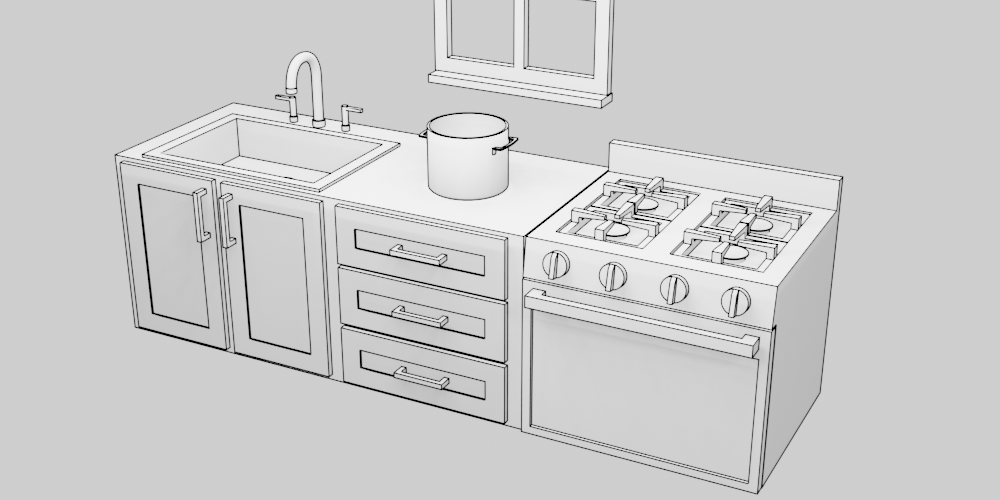
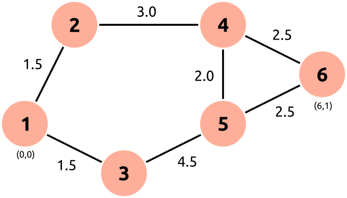

+++
title = "Action Planning in Python"
date = 2021-04-04
[taxonomies]
tags = ["ai", "python"]
+++

Automated planning is a field of AI techniques for determining how to transform the world from an initial state to a goal state. This guide implements a form of classical planning in which we represent the problem domain as a set of state variables that are modified by each action taken.

<!-- more -->

# How to Boil Water

We'll explore a toy problem domain: a kitchen with an empty pot sitting on the counter, a sink, and a stove. Our goal is to boil a pot of water.



The initial state, s0, and goal state can be described as:

| Variable      | s0      | goal    |
| ------------- | ------- | ------- |
| Chef position | counter |         |
| Chef holding  | nothing | nothing |
| Pot position  | counter | stove   |
| Pot contents  | empty   | full    |
| Faucet        | off     |         |
| Stove         | off     | on      |

Buy the time the planner is done, we want a full pot on a lit stove. While the world states must be completely defined, there are some variables we don't care about to satisfy the goal. We don't care where the chef ends up or and whether the faucet is running.

The chef's actions can change the state of the world. If the planner tells the chef to pick up the pot, the chef's hand is now holding the pot. No other variables have changed. If the planner next tells the chef to move to the sink, both the chef's position and the pot's position change.

| Variable      | s0      | pick up pot ➔ s1 | move to sink ➔ s2 |
| ------------- | ------- | ---------------- | ----------------- |
| Chef position | counter | counter          | sink              |
| Chef holding  | empty   | pot              | pot               |
| Pot position  | counter | counter          | sink              |
| Pot contents  | empty   | empty            | empty             |
| Faucet        | off     | off              | off               |
| Stove         | off     | off              | off               |

However, if the chef had moved before they were holding the pot, only the chef's position would have changed.

Also, there are some actions that don't make any sense for a given state. From s0 or s1, the planner couldn't have the chef turn on the faucet, since they're not standing in front of the sink. There are *preconditions* that must be met for some actions to be valid at a given state. The network of all possible states connected by all valid actions creates a graph, and so the problem for the planner is to find the most efficient route through this graph from initial state to goal state.

# A* Graph Traversal

[Graph traversal](https://en.wikipedia.org/wiki/Graph_traversal) has a rich history in computer science. We will step away from our action planning problem for a few minutes and explore the A* graph traversal algorithm, though other graph traversal algorithms could work. Instead of states and actions, we'll talk nodes and edges.

A pseudocode implementation is [available on Wikipedia](https://en.wikipedia.org/wiki/A*_search_algorithm#Pseudocode), and it can be translated directly into Python ([source](https://github.com/superlou/action_planning/blob/15175a1a9cf2a09b43827f1c6ed7b54fe884fc77/step1/a_star.py#L43)):

```python
def a_star(start, goal, neighbors, h):
    open_set = [start]
    came_from = {}

    # Cost of path from start node to n
    g_score = {}
    g_score[start] = 0

    # Estimated cost of path from start node through n to goal
    # This is an estimate of the total path cost
    f_score = {}
    f_score[start] = h(start, goal)

    while len(open_set) > 0:
        open_set.sort(key=lambda id: f_score.get(id, INF))
        current = open_set.pop(0)

        if current == goal:
            return reconstruct_path(came_from, current)

        for neighbor, d in neighbors(current):
            tentative_g_score = g_score.get(current, INF) + d
            if tentative_g_score < g_score.get(neighbor, INF):
                # This path to neighbor is the best one seen so far
                came_from[neighbor] = current
                g_score[neighbor] = tentative_g_score
                f_score[neighbor] = g_score[neighbor] + h(neighbor, goal)

                if neighbor not in open_set:
                    open_set.append(neighbor)


def reconstruct_path(came_from, current):
    total_path = [current]
    while current in came_from:
        current = came_from[current]
        total_path.insert(0, current)

    return total_path


INF = float('inf')
```

There are tons of resources on this algorithm available online that do a thorough job explaining it, but there are a few important concepts:

* `g(n)` - Cost of the path from the start node to some node `n`. The units of cost are problem domain specific. It could be the time it takes to walk between locations, the amount of money required to perform an action, or a weighted combinations of many factors. Since the planner will be traversing forward from the start node, `g` is well-known.
* `h(n)` - A [heuristic](https://en.wikipedia.org/wiki/Heuristic) (estimate) of the cost of the cheapest path from node `n` to the goal. This might require passing through other nodes or not, but it is simply an estimate since the planner hasn't figured out how to get from `n` to the goal yet.
* `f(n) = g(n) + h(n)` - the estimate of the cost of the total path passing through node `n`. If we are sitting at node `n` and have found new neighbor nodes, it makes sense to start looking at the neighbor with the smallest `f(n)` first if we are seeking to minimize cost.
* `neighbors(n)` - a function that returns all the nodes connected to node `n` and the cost of getting to them from `n`. The cost is `d` in the above code.
* `open_set` - the nodes that have been explored and may be "expanded," i.e. their neighbors may be candidates for reaching the goal.

At each iteration of the search, the search algorithm:

1. Estimates which node in the open set is the cheapest path to the goal,
2. And if this node is the goal, returns the path it's been building,
3. Otherwise, gets the neighbors for the current node, and, if it is the cheapest path it's seen to reach this node (since there are potentially multiple paths to a node), add it to the open set so it can be investigated as a potentially cheap path to the goal.

We'll test the implementation with a simple map of nodes that have positions and edges with a traversal difficulty.



Node 1 is the start and node 6 is the goal. The nodes are physical locations on a Cartesian coordinate system, with node 1 at (0, 0) and node 6 at (6, 1). The difficulty of traveling between nodes is shown on each edge of the graph. Note that it is not necessarily the same as the distance between the nodes. The edges and positions of the nodes are described by two functions:

```python
def neighbors(id):
    # Tuples of (destination, cost)
    linkage_map = {
        1: [(2, 1.5), (3, 1.5)],
        2: [(1, 1.5), (4, 3.0)],
        3: [(1, 1.5), (5, 4.5)],
        4: [(2, 3.0), (5, 2.0), (6, 2.5)],
        5: [(3, 4.5), (4, 2.0), (6, 2.5)],
        6: [(4, 2.5), (5, 2.5)],
    }

    return linkage_map[id]


def position(id):
    position_map = {
        1: (0, 0),
        2: (1, 2),
        3: (2, -1),
        4: (4, 2),
        5: (4, 0),
        6: (6, 1),
    }

    return position_map[id]
```

Even though we know how much it costs to go between any two nodes, the cost to move from any node to the goal isn't, as we don't know what route through other nodes is necessary. However, we might expect that the distance from a node to the goal would be a decent estimate. Our implementation will use the [Manhattan distance](https://en.wikipedia.org/wiki/Taxicab_geometry) as the heuristic.

```python
def heuristic(node, goal):
    """ Estimate of cost to reach goal from node """
    return (abs((position(node)[0] - position(goal)[0]))
            + abs(position(node)[1] - position(goal)[1]))
```

That gives us all the pieces we need to run the path finding algorithm.

```python
if __name__ == '__main__':
    path = a_star(1, 6, neighbors, heuristic)
    print('Path:', path)
```

The result is:

```
Path: [1, 2, 4, 6]
```

The full example is [here](https://github.com/superlou/action_planning/tree/main/step2). Play with the edge costs and see how they affect the selected path.

# Introducing the `namedtuple`

There's something really interesting here: the `a_star` function doesn't care what a node is. So long as a node has a unique ID and a neighbors function returns the cost of getting to new nodes with unique IDs, there's no reason this function can't operate on states and actions.

The A* search relies on being able to uniquely identify nodes. The dictionaries we store `f` and `g` scores in need to be able to identify if a node is new or is being revisited. When we ask for the neighbors of a node, it's very possible that we are doubling back. In the toy example earlier, we manually gave each node a unique ID.

Fortunately, since we're storing this information in dictionaries, and Python dictionaries can treat any hashable datatype as a key, we just need to make sure our state is hashable. To do this, we use the `namdetuple` factory function. Technically, we could use tuples, but these will make the code more readable.

The following captures the state of a node in the boil-water problem domain:

```python
State = namedtuple('State', ('pos', 'pot_pos', 'pot_filled', 'faucet_on',
                             'stove_on', 'holding'))

# Create an initial condition
s0 = State(pos='counter', pot_pos='counter', pot_filled=False,
           faucet_on=False, stove_on=False, holding=None)
```

One thing to note with tuples is that they are immutable. Their values can't be changed, but a new tuple based on another can be created.

```python
s0.pos = 'stove'                # Doesn't work
s1 = s0._replace(pos='stove')   # Works
```

# A New Heuristic

Now that nodes don't represent physical locations, the Manhattan distance no longer works as a search heuristic. If the goal is to find a node as similar as possible to the goal, a node with fewer differing variables is likely closer to the goal. Remember, it's just an estimate to improve the search performance, not crucial to the ability of eventually finding a path.

We'll also recognize that not all state variables matter to our goal. In the implementation, a goal is the same type of `namedtuple` as a state, but we won't fill in all the fields and let variable that aren't important default to an Ellipsis (`...`).

```python
fields = ('pos', 'pot_pos', 'pot_filled', 'faucet_on', 'stove_on', 'holding')
State = namedtuple('State', fields, defaults=(...,) * len(fields))

s0 = State(pos='counter', pot_pos='counter', pot_filled=False,
           faucet_on=False, stove_on=False, holding=None)

# Where fields are not assigned a value, they default to Ellipsis (...)
s_goal = State(pot_pos='stove', stove_on=True, pot_filled=True, holding=None)

def heuristic(node, goal):
    """ Estimate of cost to reach goal from node """
    return len(tuple_diff(node, goal))

def tuple_diff(a, b):
    """
    Return a list of all fields that differ between tuples a and b, ignoring
    fields marked Ellipsis in either field.
    """
    return [(field, getattr(a, field), getattr(b, field))
            for field in b._fields
            if getattr(a, field) != getattr(b, field) and
            getattr(a, field) != ... and getattr(b, field) != ...]
```

# Describing Neighbors in the Problem Domain

The last piece missing for A* is the neighbors function. It still receives a node in the graph, now a state, but the edges between nodes, actions, are going to be more interesting. Start by adding the states that result from a "move" action:

```python
def neighbors(state):
    # We still a list of connected states and the cost
    # of traveling to them from the current state as tuples, but the shape
    # of the function is the same as before.
    states = [move(state, pos) for pos in ['sink', 'counter', 'stove']]
    states = [state for state in states if state is not None]
    return states

def move(state, to):
    if state.pos == to:   # Precondition: can't move to where you already are
        return None

    state = state._replace(pos=to)

    if state.holding is not None:
        moving_object = {state.holding + '_pos': to}
        state = state._replace(**moving_object)

    return state, 1, 'move to ' + to
```

We start out by adding all possible move actions. The chef can move to the sink, counter, and stove at will, but it doesn't make sense to allow the chef to move to a place that he's already been. This is the *precondition*, and if the precondition isn't met, there is no new node connected. The `neighbors` function will discard it before returning the list of all neighboring state nodes. This is very similar to the approach taken by classical planners like [STRIPS](https://en.wikipedia.org/wiki/Stanford_Research_Institute_Problem_Solver), except it is extended to operate on procedural conditions as with [GOAP](https://alumni.media.mit.edu/~jorkin/goap.html).

All actions can be defined as functions that return a 3-value tuple with the new state, the cost of the action, and a text string describing the action. The text description isn't necessary for the A* search, but it will capture the action required to get from the start to the goal.

Continuing with the heavy influence from GOAP, the effects of the action are also procedural. The position of the chef is set to the passed `to` parameter, and if the chef is holding an object, the position of that object is updated as well.

All of the actions the chef can take are defined in the same manner: first, check if the preconditions are met, second, return a new state with the effects of the action applied. The final list of actions is:

```python
def neighbors(state):
    states = []

    states += [move(state, pos) for pos in ['sink', 'counter', 'stove']]
    states += [pick_up(state, 'pot'), put_down(state)]
    states += [turn_on(state, 'faucet', 'sink'),
               turn_off(state, 'faucet', 'sink'),
               turn_on(state, 'stove', 'stove'),
               turn_off(state, 'stove', 'stove')]
    states += [wait(state)]

    states = [state for state in states if state is not None]

    return states
```

The rest of the action functions are [here](https://github.com/superlou/action_planning/blob/15175a1a9cf2a09b43827f1c6ed7b54fe884fc77/step4/action_planning.py#L19-L60).

# Running the Planner

A tweak to the A* search algorithm is required to keep track of the action descriptions. Previously, every edge implied a "move," so it wasn't needed before.


```python
def reconstruct_path(came_from, current):
    total_path = [(current, 'goal')]

    while current in came_from:
        current, action = came_from[current]
        total_path.insert(0, (current, action))

    return total_path

def a_star(start, goal, neighbors, h):
  ...
        for neighbor, d, action in neighbors(current):
            tentative_g_score = g_score.get(current, INF) + d
            if tentative_g_score < g_score.get(neighbor, INF):
                # This path to neighbor is the best one seen so far
                came_from[neighbor] = current, action
                g_score[neighbor] = tentative_g_score
                f_score[neighbor] = g_score[neighbor] + h(neighbor, goal)

                if neighbor not in open_set:
                    open_set.append(neighbor)

```

With this change, the planner is run the same way as before.

```python
if __name__ == '__main__':
    s0 = State(pos='counter', pot_pos='counter', pot_filled=False,
               faucet_on=False, stove_on=False, holding=None)
    s_goal = State(pot_pos='stove', stove_on=True, pot_filled=True, holding=None)
    path = a_star(s0, s_goal, neighbors, heuristic)

    print('Path:')
    for step in path:
        print(step[1])
```

The search result is:

```
Path:
pick up pot
move to sink
turn on faucet
wait
move to stove
put down pot
turn on stove
goal
```

This looks pretty good, but we left the water faucet running! If we look back at `s_goal`, it's because we didn't require the faucet to be off in the goal. Making the responsible modification to the goal, the new path is:

```
Path:
pick up pot
move to sink
turn on faucet
wait
turn off faucet
move to stove
put down pot
turn on stove
goal
```

Much better.
