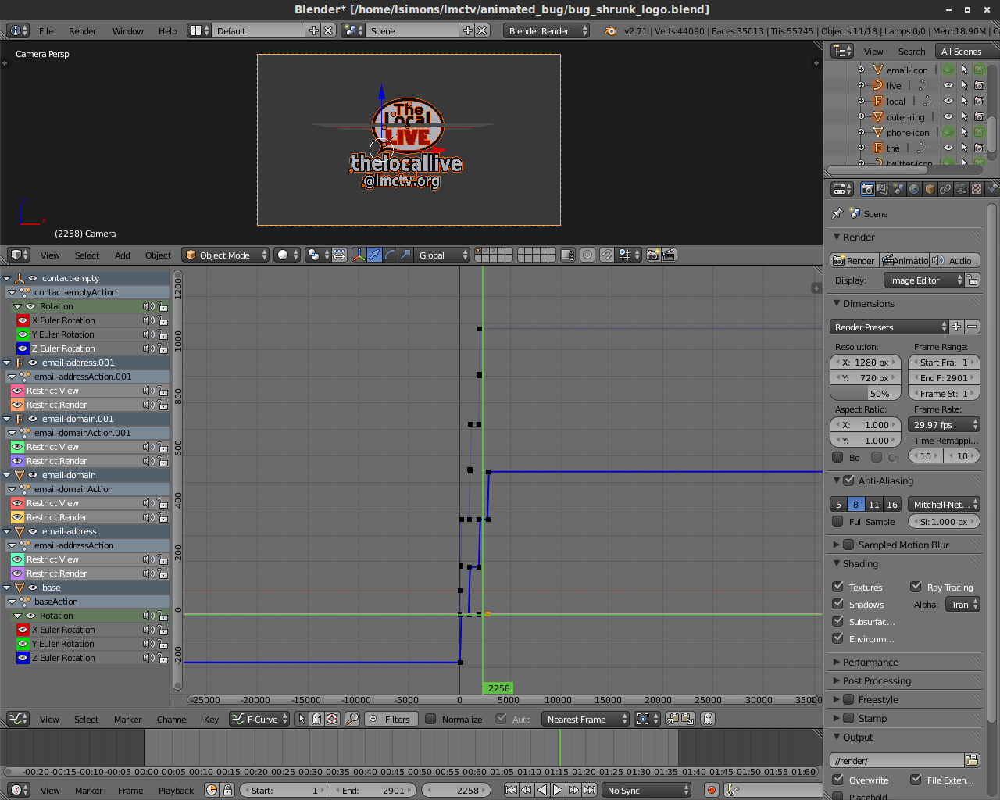
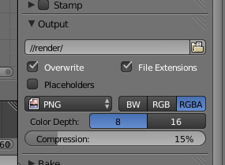

+++
title = "Animated Bugs with Blender and Tricaster"
date = 2014-08-31
[taxonomies]
tags = ["linux", "video production", "blender", "avconv", "tricaster"]
+++

The local public access station produces a weekly news/entertainment program called The Local Live.  The format features a live interview segment where community calls, emails, and tweets are taken on the air.  To keep the contact information onscreen throughout the entire segment, I wanted to animate the contact info into a graphics bug.  The station uses a Newtek Toaster Tricaster 860.  By dedicating a video playback DDR to a DSK channel, we can overlay videos with alpha.

<!-- more -->

# Create the Animation in Blender

This is the time consuming part.  Since all I needed was some rotating graphics, this was more tedious than difficult.  Likely, there are more efficient tools than Blender for this (giving the text meshes an outline was painful), but sometimes you only have a hammer.



If you’re also making a bug, here’s some things to keep in mind:

* Make sure that your video loops seamlessly.  This will let you set the DDR on loop so you can run the bug.
* Think about the graphic elements that make up the bug.  It’s very easy to lose track of scale when you are zoomed in and fine-tuning animations.  Make sure your text will be readable after the graphic is scaled and positioned on-screen.
* Consider removing all lamps from the scene and use environment lighting.  This can give you a very soft light that makes your graphic look less like an intro-to-3D-modeling project.
* In the Scene Properties, don’t set your resolution overly high.  In my settings, I used 1280×720 pixels, but left the render scale percentage at 50%.  Make sure that the bug fills the camera’s viewport well, but does not clip.  An alternative is to make your render at your full broadcast resolution and position the camera so that the bug is the expected size and position in the frame, but this can make it awkward to work with down the road, since the video will be mostly empty space.  Double check your framerate settings so that everything plays back at the expected speed when we’re done.

Tricaster supports transparency in the DDR through Quicktime videos with alpha.  Since Blender doesn’t render (at least on my system) directly to this format, we’ll output a series of PNGs and combine them later into the video.  By rendering to “//render/”, I’ll get a folder with a set of PNG files titled 0001.png, 0002.png, 0003.png, etc.  Make sure that “RGBA” is selected so that we have the alpha channel for transparency.



The final Blender file is available for reference [here](bug.blend).

# Merging the Image Sequence

We’ll create the video from our rendered image sequence using Libav‘s avconv utility.  It’s an easy one-liner:

```sh
avconv -r 29.97 -i render/%4d.png -vcodec png bug.mov
```

This explicitly tells avconv the framerate to use, the location and filename format of the images (%4d refers to a 4-digit integer), the video codec, and the output wrapper.  Once done, you should have .mov file that you can play in your player of choice.   The area where the video is fully transparent is typically black, though it may vary from player to player.  Note that these files will be pretty large because of the codec we’re using.  My 2 minute bug came to around 100 MB.

# Setting Up Tricaster

Import the video as you would any other media, except make sure you do not enable transcoding, which may remove the transparency.  With some luck, you have a free DDR.  I added the bug video to DDR2, and set the DDR to autoplay+single+loop.  Set DSK2 to use that DDR.  You can position and scale the bug using the standard DSK transform controls.  Now, when you fade-in DSK2, it will fade-in the graphic and start the animation.  Since we made sure our video loops seamlessly, you can leave it up until you are bored with it.  You can see the finished project in action in the lower-right corner of the show.

<p><iframe width="560" height="315" src="https://www.youtube.com/embed/fpO8IF18ueo" frameborder="0" allowfullscreen></iframe></p>
