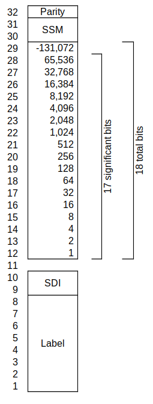

+++
title = "ARINC 429 BNR Fields"
date = 2023-11-26
[taxonomies]
tags = ["avionics"]
[extra]
katex = true
+++

ARINC 429 defines the physical layer (shielded, twisted pair, differential, return to zero), the basic data unit (word), and a file transfer protocol. A [32-bit word](https://en.wikipedia.org/wiki/ARINC_429#Word_format) encodes aircraft data as:

* BNR - binary, a [two's complement](https://en.wikipedia.org/wiki/Two%27s_complement) representation of a real number
* BCD - [binary coded decimal](https://en.wikipedia.org/wiki/Binary-coded_decimal)
* Discrete - boolean values coded into individual bits as 0 or 1

There are also wild combinations of those three and legacy encodings for generations of legacy equipment. This soapbox will discuss how to describe BNR encoding in a way that aligns with the ARINC 429 specification.

<!-- more -->

Since an ARINC 429 word can contain multiple pieces of aircraft information encoded differently, it is useful to refer to a specific data encoding within the ARINC 429 word as a field. The majority of BNR words have a single BNR field that starts in bit 29 and continues for some number of bits.

A two's complement number can encode from its most negative value to one "resolution" less than the absolute value of the minimum value. If a BNR label can encode -4 with a precision of 0.25, the maximum value it can encode is 3.75. A BNR label can *always* encodes a plus or minus value. There is no such thing as a "positive-only" BNR encoding. That would not be BNR. However, it is not unusual to have BNR values where a negative value might be unreasonable, e.g., Mach.

The commentary on page 5 of ARINC 429 says:

> ...the units maximum value and resolution are first determined in that order. The least significant bit of the word is then given a value equal to the resolution increment, and the number of signifant bits is chosen such that the maximum value of the fractional binary series just exceeds the maximum value of the parameter...

However, if you're trying to coordinate interface requirements between two avionics vendors for existing BNR encodings, talking in terms of resolution is  prone to errors. Once the resolution gets small enough, it's difficult to verbally express. Spreadsheets with rounding errors can cause subtle errors between encoding and decoding. For example, when discussing GPS coordinates for a modern INS which range from -180° to almost (remember: two's complement) +180°, the BNR encoding might use all data bits *and* the SDI bits, with a resolution of 0.000085830688°. In a spreadsheet, this may be displayed as 8.58e-5°, but this adds error. It is unwieldy and not precise in conversation.

Instead, I strongly recommend communicating BNR specifications in terms of a the maximum value and significant bits. However, although "significant bits" are mentioned in the commentary above, ARINC 429 does not clearly define the significant number of bits. It is inferred through the example in the commentary:

> ...if the [BNR encoding] is required to transfer altitude in units of feet over a range of zero to 100,000 feet with a resolution of one foot, the number of significant bits is 17 and the maximum value of the fractional binary series is 131,071 (.e., 131,072 - 1).

The following diagram demonstrates the value of each bit in the BNR encoding from the example.

The ARINC 429 commentary has the unexpected result that the number of significant bits is *1 less* than the total number of bits required for the BNR encoding. This definition of significant bits also has the property that the resolution definition from the largest absolute value, the minimum value, is very simple:

$$resolution = \frac{-min}{2^{sigbits}}$$

When you are documenting interfaces for BNR, simply provide:

1. The most negative value
2. The number of significant bits per the (inferred) ARINC 429 specification
3. The position of the "sign" bit, typically bit 29

All three of these numbers are easily expressed in interface control documents and over the phone without rounding very small decimal precisions.