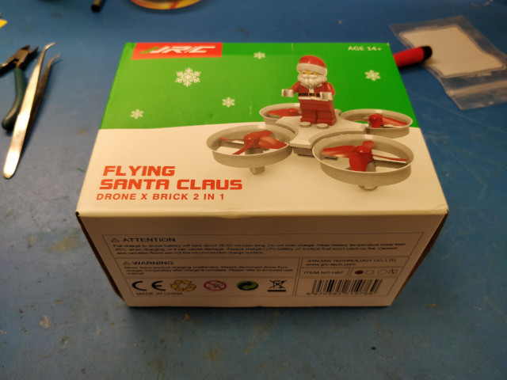
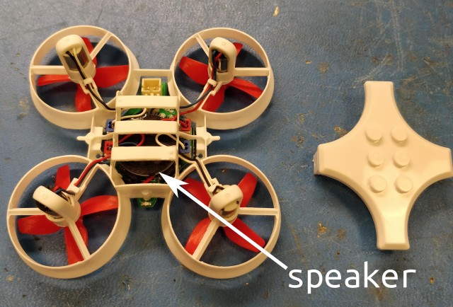
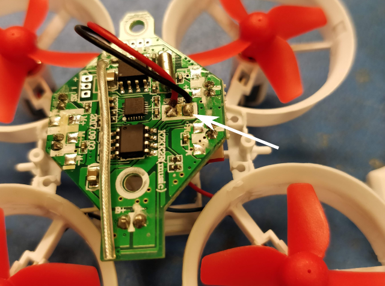
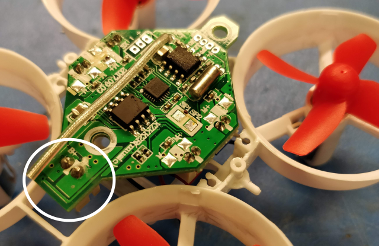
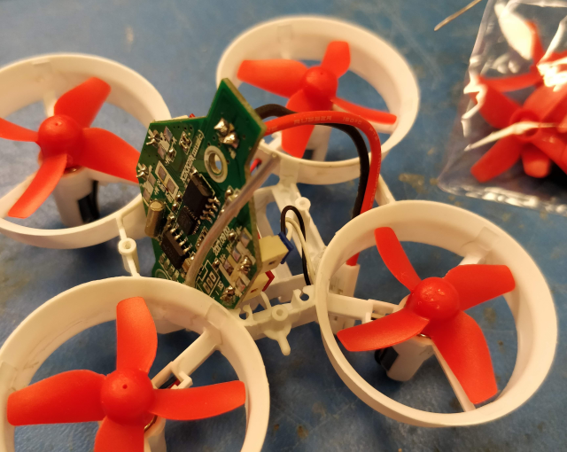
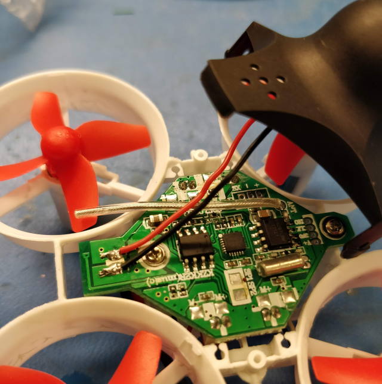
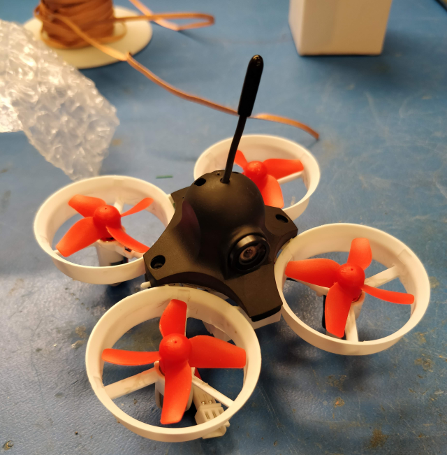
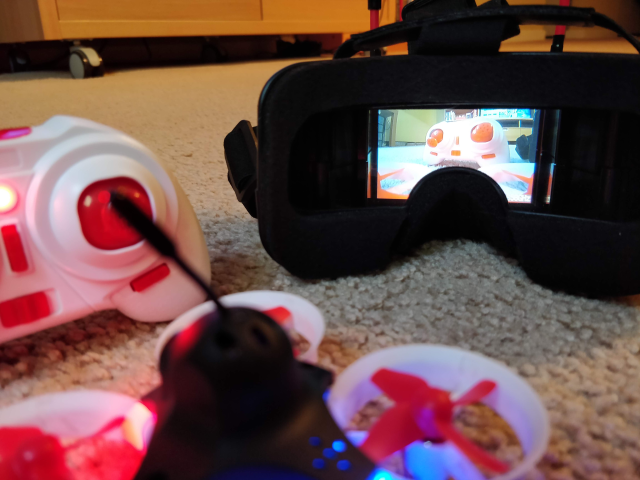

+++
title = "Budget Indoor Quadcopters"
date = 2019-01-15
[taxonomies]
tags = ["quadcopters"]
+++

Remote control quadcopters have been around for years, as has been "First-Person View" flying. If you're new to the hobby, plowing an expensive FPV racing drone into a house might not seem too appealing. There are also some considerations [imposed by the FAA](https://www.faa.gov/news/fact_sheets/news_story.cfm?newsId=22615). However, there are indoor miniature quadcopters now, and here's how to put one together on-the-cheap. You can go from zero to FPV for about $70, including the drone, remote control, and goggles.

<!-- more -->

## Materials

You'll need the following parts, all of which are available online. While a soldering station is required, all of the contacts soldered are large.

1. RC quadcopter
2. 5.8 GHz camera
3. 5.8 GHz goggles

### RC Quadcopter
There are many options, but you want something with a 65 mm span between diagonal motors. These are the smallest, readily available size and are often referred to as "[tiny whoops](https://www.tinywhoop.com/)." I bought an Eachine E011C ([Banggood](https://www.banggood.com/Eachine-E011C-Flying-Santa-Claus-With-Christmas-Songs-716-Motor-Headless-Mode-RC-Quadcopter-p-1205851.html?p=9P091027571160201812&custlinkid=117608)) which includes:

* Frame
* Flight controller with integrated receiver - This small PCB provides all of the control and drive circuitry. This flight controller (FC) integrates a Bayang protocol receiver, which means it has the circuitry and antenna required to receive signals from a bayang remote control.
* 4 brushed DC motors - The E011 and E011C are particularly nice because they include 7x16 mm motors, which provide more power than the 6x15 mm motors on an E010 or E013 drone. While these brushed motors wear out over time, replacements are inexpensive.
* 4 propellers
* Battery - a 260 mAh LiPo battery
* Remote control - The included remote uses the Bayang protocol to match the receiver on the flight controller.
* A lego Santa Claus

### 5.8 GHz Camera

Low-cost FPV drones usually broadcast analog video in order to minimize latency and cost. We want a camera with a built-in 5.8 GHz transmitter. While there are both NTSC and PAL cameras, the important thing is that the goggles match. That said, most newer cameras can switch between NTSC and PAL modes as well as many frequencies.

Here are some options:

* 5.8 GHz FPV camera installed in a canopy ([Amazon](https://www.amazon.com/gp/product/B07DHHYJ6B/ref=as_li_tl?ie=UTF8&camp=1789&creative=9325&creativeASIN=B07DHHYJ6B&linkCode=as2&tag=louissimonsco-20&linkId=0c8c177cc05271f7e05892f5853cc65a)) - This is probably the easiest one to get started with since it is already installed in a canopy.
* 5.8 GHz FPV camera with OSD signals ([Aliexpress](https://www.aliexpress.com/item/LST-S2-5-8G-800TVL-HD-Micro-CMOS-FPV-Camera-150-Degree-Angle-Of-View-3/32856883661.html?spm=a2g0s.9042311.0.0.643c4c4ddaBgMn)) - This camera is a little cheaper and provides video input and output signals. Down the road, you could use these with a flight controller that supports an On-Screen Display (OSD). The camera's video output is overlayed with information like flight duration then sent back to the camera for broadcast via the video input signal. Since the E011C doesn't support OSD, it's not necessary. However, you will also need to buy a canopy or hack something together to hold it in place.

### 5.8 GHz Goggles

Any pair of goggles that matches the frequency and video standard of the camera will work. The Eachine VR006 ([Banggood](https://www.banggood.com/Eachine-E013-VR006-VR-006-One-antenna-3-Inch-5_8G-40CH-Mini-FPV-Goggles-Build-in-3_7V-500mAh-Battery-p-1239625.html?p=9P091027571160201812&custlinkid=117605)) is the lowest priced goggles I could find with reasonable reviews. If you need goggles faster, the Makerfire Mini FPV goggles ([Amazon](https://www.amazon.com/gp/product/B07F292TWS/ref=as_li_tl?ie=UTF8&camp=1789&creative=9325&creativeASIN=B07F292TWS&linkCode=as2&tag=louissimonsco-20&linkId=d912e7828ff0fc304bfe08cabb5d1fe9)) are more expensive.

While the goggles are the most expensive single component of this build, they can be used in future builds.

### Optional Parts

While everything above is the bare minimum to start flying, these parts have enough added value that they're worth considering:

* JST PH 2.0 connector cable ([Amazon](https://www.amazon.com/gp/product/B072B66P5C/ref=as_li_tl?ie=UTF8&camp=1789&creative=9325&creativeASIN=B072B66P5C&linkCode=as2&tag=louissimonsco-20&linkId=fef2e441691dcf64402afc61b69e6e93)) - This is the same cable that mates with the provided battery. While the provided battery has a wired connector that plugs into the flight controller, many batteries have the connector hard mounted to the battery. By replacing the board-mount connector on the flight controller PCB with this cable, you can connect to either battery.
* 260 mAh HV 1S LiPo battery x8 ([Amazon](https://www.amazon.com/gp/product/B07121V7MB/ref=as_li_tl?ie=UTF8&camp=1789&creative=9325&creativeASIN=B07121V7MB&linkCode=as2&tag=louissimonsco-20&linkId=e088e4a340d129c65bb3f22de8220bfc)) - If you want to fly for more than 2 minutes at a time, you'll need more batteries. These "high-voltage" batteries can charge to 4.35 V to hold more energy.
* 1S LiPo HV charger ([Amazon](https://www.amazon.com/gp/product/B07KBZCCZ3/ref=as_li_tl?ie=UTF8&camp=1789&creative=9325&creativeASIN=B07KBZCCZ3&linkCode=as2&tag=louissimonsco-20&linkId=7f22d82c78e54a428074c6b0f42b3e7d)) - This charger can charge either 4.2 V or 4.35 V 1S LiPo batteries.
* LiPo charging safety bag ([Amazon](https://www.amazon.com/gp/product/B00T01LLP8/ref=as_li_tl?ie=UTF8&camp=1789&creative=9325&creativeASIN=B00T01LLP8&linkCode=as2&tag=louissimonsco-20&linkId=53d90d75431838a0a6fcbe78b7e9eaa2)) or ([AliExpress](https://www.aliexpress.com/item/LiPo-Li-Po-Battery-Fireproof-Safety-Guard-Safe-Bag-185-75-60MM-IUNEED-TOY-Store/1000004733398.html?spm=a2g0s.9042311.0.0.70044c4dU20h0b))- Battery safes trap a fire in the case of battery failure during charging.

## Building

The E011C is festive.

However, the medley of Christmas music gets old, and the speaker is added weight. The speaker is on the bottom of the quadcopter, attached to the PCB. You can see it under the battery holder.

Desolder the black and red wires connecting the speaker to the PCB pads.

Optionally, remove the battery header that is soldered to the PCB and replace it with a wired connector.

Be very careful to make sure that the red and black wires connect to the positive and negative pads respectively.

Cut the connector of the camera, leaving as much wire as possible. Strip back the wires and solder the red and black wires to the positive and negative battery terminals.

Since this camera comes preinstalled in a canopy with an insulating bumper on the bottom of the camera, assemble by gently pulling apart the camera's bottom tabs and slipping them over the posts on the frame.

Charge the quadcopter's and goggle's batteries. Power everything up and use the frequency scan on the goggles to find the camera's video signal.

Happy flying!
