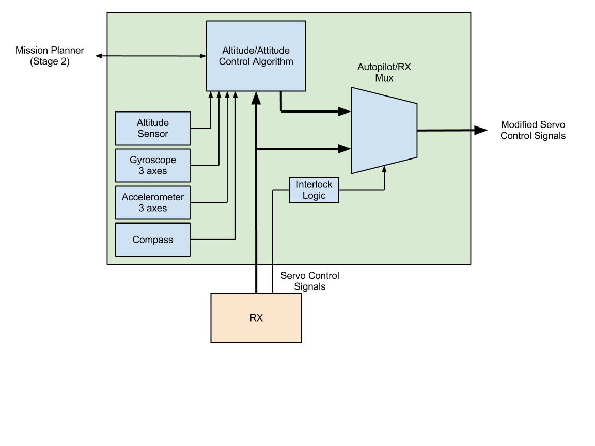

+++
title = "Building a UAV"
date = 2013-03-21
[taxonomies]
tags = ["uav"]
+++

> Or, how I started another project I was unlikely to finish.

It seems like everybody else has a UAV, and I don’t. So, let’s try to build one. I’m a poor writer, but if I force myself to document things in this blog, there’s a small chance I’ll keep myself from forgetting why I made decisions and going in circles.

<!-- more -->

I’m going to break down the UAV into a few subsystems to make things manageable.

1. Airframe – holds things
2. Flight Controller – keeps things flying straight and level and provide active stabilization on top of operator signals
3. Mission Controller – make the UAV do interesting things on its own

There’s probably some other parts, but I don’t know enough about UAVs or R/C aircraft to speak to the subject. I’m not quite sure why I’m splitting up the Flight and Mission Controller yet, but it seems like a decent way of keeping the design requirements focused. I’ve been looking at some existing autopilot boards, and haven’t seem to find one I liked that had all the features I wanted. I’m looking for:

* 8 receiver channels, with 1 channel being decoded in hardware to enable the autopilot or bypass the microprocessor
* Accelerometer, gyroscope, altitude, and compass
* DSP capable processor with a Linux compatible tool-chain
The architecture is something like this:

After some searching, I did the thing I usually do when I feel like Google isn’t providing a good idea of where the community is: hit up IRC. Nebukadneza from ##radiocontrol on Freenode was incredibly patient with me and pointed me towards the Naze32. It’s a great piece of hardware at an awesome price, but doesn’t have software independent bypasses. We’re doing a bunch of development stuff and need to give control to the ground operator if/when the software locks up. I’m going to thus use this minor nitpick to design my own flight controller. As I go, I’ll try to write articles about what I’ve learned and how I’ve applied it to the autopilot.

I’m open to any comments, criticisms, feature requests, etc.
