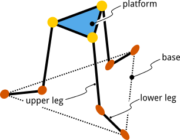
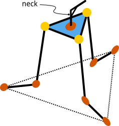

+++
title = "Deskbot Part 1, Architecture"
date = 2015-01-30
[taxonomies]
tags = ["robotics"]
[extra]
katex = true
+++

It's been a while since I've done any robotics, so let's make that happen.  When designing an autonomous system, it's critical to have clear objectives so that the requirements for end effectors, sensory inputs, and processing resources can be achieved inside your cost and time budgets.  Instead of that, let's try to settle an office debate: what are the kinematics of a robotic platform positioned by 3 control rods?

Then, we'll put eyes on it.  And it needs to fit on my desk; my apartment is not very large.

<!-- more -->

# Platform Kinematics

The control of the platform, i.e. head, needs to use a minimum number of servos.  Since linear actuators are bulky and expensive, we'll use 3 servo motors to control the orientation of the platform.  The servo motor arms will face "inwards" towards the platform, and a hinged leg on each motor will terminate in a ball-joint at the platform.  Letting the center of rotation of the servos create our base reference frame, the system looks like this:

It's a [parallel robot](https://en.wikipedia.org/wiki/Parallel_manipulator) a little like a stripped down [Stewart Platform](https://en.wikipedia.org/wiki/Stewart_platform), popular for it's six degrees of freedom.  Each orange joint has 1 degree-of-freedom (DOF) and rotates like a hinge.  Each yellow joint has 3 DOFs, fixing the connection in space but ideally allowing unconstrained rotation.

Our back of the napkin guess is that the 3 servos should give us 3 DOFs if our design is well constrained.  A more formal analysis using the mobility formula agrees.  Our simplified platform system is composed of 7 linked rigid bodies: 3 lower legs, 3 upper legs, and the platform itself.  These are all referenced to a fixed global reference plane that the lower legs are attached to.  These $n$ movable bodies each have 6 degrees of freedom before and linkages are made.  Then, each linkage removes up to 6 degrees of freedom, e.g. a hinge or linear slider removes 5, a planar slider removes 4, a spherical ball joint removes 3.  This gives us the mobility formula for our 6 hinge joints and 3 ball joints:

$$M = 6n - \sum_{i=1}^{j}6-f_i$$

$$M = 6 * 7 - \left(6 * 5 + 3 * 3\right) = 3$$

Since the platform is the basis for our robot's head, we'll add one more servo in the center of the platform.  This neck allows the robot to look left and right.  This adds a fourth degree of freedom which can be verified using the same formula.

# Concept Investigation

Now that we have explored the kinematics, we can waste time with some concept renders showing the interaction of the 4 servos.  Modeling the system to scale in [Blender](http://www.blender.org/) and using inverse kinematic constraints  to "pull" the head and platform demonstrates that the basic concept works out.

<iframe src="https://player.vimeo.com/video/134567892" width="500" height="281" frameborder="0" webkitallowfullscreen mozallowfullscreen allowfullscreen></iframe>

For this project, all resources will be in a [Github repository](https://github.com/superlou/deskbot).
