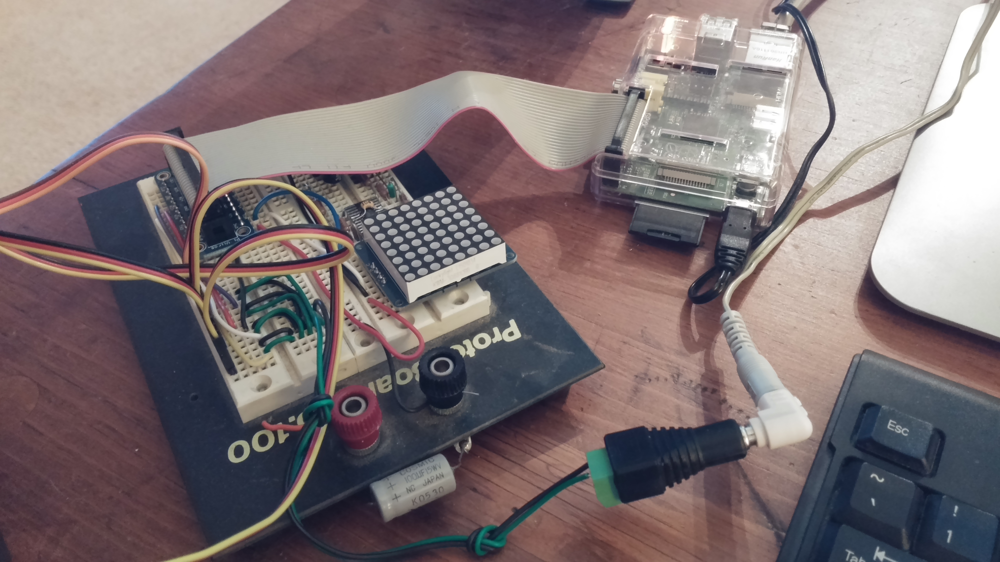

+++
title = "Deskbot Part 2, Hardware Prototype"
date = 2015-02-12
[taxonomies]
tags = ["robotics"]
[extra]
katex = true
+++

Let's make a desktop robot that moves.  But wait, we have no tools.

<!-- more -->

# Mechanics

We're going to have to deal with as many off the shelf parts as possible.  If you remember from our previous episode, it's going to look something like this:


Since this is a prototype, we'll focus on the core parts of the mechanism.


The lower actuators are 3 Hitec <a rel="nofollow" href="http://www.amazon.com/gp/product/B0006O3WVE/ref=as_li_tl?ie=UTF8&camp=1789&creative=9325&creativeASIN=B0006O3WVE&linkCode=as2&tag=louissimonsco-20&linkId=GE5LAFLM5GMG2ZRK">HS-311 servos</a>.  Attached directly to the servo is a "servo horn," luckily one of the ones supplied.  Now we need to get creative.  For the vertical upper leg, I used Du-Bro [4-40 Safety Lock Kwik-Links](http://shop.dubro.com/p/4-40-safety-lock-kwik-link-qty-pkg-2) with a [Heavy Duty 4-40 Ball Link](http://shop.dubro.com/p/heavy-duty-4-40-ball-link).


Du-Bro seems to have some quality control issues on these parts.  One of the ball links and one of the Kwik-Links weren't threaded, but luckily the office has a tap and die set.  At the servo horn/Kwik-Link joint, we want a 1 degree-of-freedom hinge, so carefully expand the servo horn to accommodate the Kwik-Link pin with a small screwdriver bit.  The soft plastic of these parts (and the concentration of force at the hinge joint) will limit the accuracy of the system's control, but for a light platform, it seems good enough.  A future prototype should focus on making sure the knee hinge is more robust to off-axis forces.

The fourth servo is a Tower Pro [SG92R micro servo](http://www.adafruit.com/products/169) from Adafruit.  It's smaller than the rest since not much torque is required, and we want to minimize the weight and size of parts going in the platform.

The platform itself is made up of two custom parts designed in FreeCad.  They were designed to be as cheap to 3D print as possible, so complexity and volume are kept to a minimum.  The flat servo [head mount](https://www.shapeways.com/model/upload-and-buy/3670039) and [socket pin](https://www.shapeways.com/model/upload-and-buy/3669953) are a couple dollars from Shapeways, though I'm not sure the dimensions will work out, as I had them printed by a local shop on a Makerbot.


The printed parts needed a lot of clean-up, especially the socket pins, due to the precision of the FDM process.  To get the ball links to spin freely in the sockets, I borrowed the office drill press and used a ball link to ream out the socket pins.


The finished platform assembly with base servos was cut into some cardboard.


# Electronics

The brain of the robot will be a Raspberry Pi, the old original version I had lying around.  A newer <a rel="nofollow" href="http://www.amazon.com/gp/product/B00T2U7R7I/ref=as_li_tl?ie=UTF8&camp=1789&creative=9325&creativeASIN=B00T2U7R7I&linkCode=as2&tag=louissimonsco-20&linkId=COUIVEL37H6GAK3A">Raspberry Pi 2 Model B</a> should work just as well, and give a lot more flexibility on the software, but you'll need a 40-pin <a rel="nofollow" href="http://www.amazon.com/gp/product/B00OJEKNUK/ref=as_li_tl?ie=UTF8&camp=1789&creative=9325&creativeASIN=B00OJEKNUK&linkCode=as2&tag=louissimonsco-20&linkId=INYBXWJJAI3GIPAA">GPIO Cobbler Plus</a> instead of the older style breakout.

In lieu of a proper schematic, the connections are:

* All servo power lines to the servo power supply, a 4 V wall wart I had lying around, though it should really be around 6 V.
* Connect the servo grounds to the power supply ground.
* Connect the servo power supply ground to the RPi ground.
* Connect the four servo signal lines to pins 18, 23, 24, and 25.



# Software

Raspian is used as the RPi's OS.  To keep the software readable, I oscillated between high level languages, Ruby and Python.  I like the Ruby syntax better, but  the numerical computing libraries for Python are much more mature, and I later found Cython to be a critical tool for improving performance.

[Pi-blaster](https://github.com/sarfata/pi-blaster) is used to create PWM signals on the RPi's GPIO pins.  The [code for controlling the servos](https://github.com/superlou/deskbot/tree/master/code) is wrapped in a pair of helper classes: `PiBlasterServos`, and `Servo`.  These classes abstract the process of interpolating a servo angular position to a PWM period and writing it to `/dev/pi-blaster`.  Controlling a servo is done like so:

```python
# parameters are the 0 degs PWM period, -90 degs, and +90 degs
s0 = Servo(0.15, 0.065, 0.225)  
pbs = PiBlasterServos()
pbs.add(s0, 18)  # use pin 18
pbs[0] = 0.0     # set the first servo added to 0 degrees
```

By varying the position of the 4 servos in time, we can start animating the robot.

<p><iframe src="https://player.vimeo.com/video/136165642" width="500" height="281" frameborder="0" webkitallowfullscreen mozallowfullscreen allowfullscreen></iframe></p>
