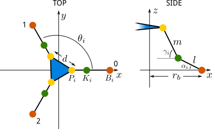

+++
title = "Deskbot Part 3, Forward Kinematics"
date = 2015-06-12
[taxonomies]
tags = ["robotics"]
[extra]
katex = true
+++

The process of determining the state of the robot from the control inputs is the [forward kinematics](https://en.wikipedia.org/wiki/Forward_kinematics).  For a given set of 4 servo positions, we should be able to predict the orientation of all parts of the robot.

<!-- more -->

Here's our model of the robot head platform.  There's one more servo on top, but because that's a serial linkage, as opposed to the three parallel mechanisms at the base, we can account for that later.  The platform itself is an equilateral triangle.  While this arrangement could be generalized further, the following assumes that the base points also form an equilateral triangle, aligned with the platform.



From the diagram, we see that for each hinged linkage from a servo to the platform, the three points - base $B_i$, knee $K_i$, and platform $P_i$ - move in a single plane.  The base points are at:

$$B_i=\begin{bmatrix}b_{xi}\\b_{yi}\\0\end{bmatrix}=\begin{bmatrix}r_b cos(\theta_i)\\r_b sin(\theta_i)\\0\end{bmatrix}$$

Knowing the three servo angles $\theta_i$, the knee points are analytically solvable with basic geometry.

$$
K_i= B_i +
\begin{bmatrix}
  l cos(\pi+\theta_b) sin(\alpha_i) \\\\
  l sin(\pi+\theta_b) sin(\alpha_i) \\\\
  l sin(\alpha_i)
\end{bmatrix}
$$

Likewise, if we know $\gamma_i$, the platform points are solvable:

$$
P_i= K_i +
\begin{bmatrix}
  l cos(\pi+\theta_b) sin(\gamma_i) \\\\
  l sin(\pi+\theta_b) sin(\gamma_i) \\\\
  l sin(\gamma_i)
\end{bmatrix}
$$

Now, the problem is, we don't know $\gamma_i$.  Fortunately, we can construct three equations to solve for these: the distance between any to $P_i$ is fixed by the geometry of the platform.  To use fsolve from SciPy's optimization package to solve simultaneous functions, we need to write a minimization function.

```python
class DeskbotModel(object):
    ...

    def errors(self, p):
        gamma_0, gamma_1, gamma_2 = p
        gamma = np.array([gamma_0, gamma_1, gamma_2])

        # Determine positions of platform points
        self.p = np.array([
            self.k[0] + self.m * np.cos(np.pi + self.theta_b) * np.cos(gamma),
            self.k[1] + self.m * np.sin(np.pi + self.theta_b) * np.cos(gamma),
            self.k[2] + self.m * np.sin(gamma),
        ])

        d01 = np.linalg.norm(self.p[:, 0] - self.p[:, 1])
        d12 = np.linalg.norm(self.p[:, 1] - self.p[:, 2])
        d20 = np.linalg.norm(self.p[:, 2] - self.p[:, 0])

        return (d01 - self.d[0], d12 - self.d[1], d20 - self.d[2])
```

The array of three gamma values is then found by `optimize.fsolve(self.errors, (1.57, 1.57, 1.57))`.  Our initial guesses are $\pi/2$, a 90 degree bend at each knee, in the hope of the solver picking the platform position above our global reference frame, as there is another solution (probably multiple).  After solving, we can then determine the location of all 3 platform points.  Everything after that is a little bit of vector math, but is simple serial links to solve for the geometry.
