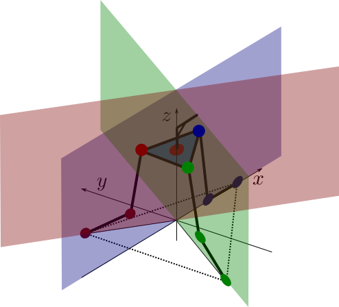
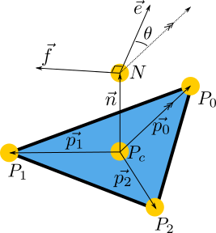

+++
title = "Deskbot Part 4, Inverse Kinematics"
date = 2015-12-16
[taxonomies]
tags = ["robotics"]
[extra]
katex = true
+++

Unfortunately for us, forward kinematics doesn't let our robot control itself.  To determine the servo positions that achieve a robot position, we need [inverse kinematics](https://en.wikipedia.org/wiki/Inverse_kinematics).

<!-- more -->

In a perfect world, there is an analytical function that takes a robot state as input variables and spits out servo positions.  Even if you can't come up with a simple analytical solution, if you have a fast solution to the forward kinematis, you can use something like [coordinate descent](https://en.wikipedia.org/wiki/Coordinate_descent) or [particle swarm optimization](https://en.wikipedia.org/wiki/Particle_swarm_optimization).  These techniques provide efficient numerical solutions with large numbers of dependent variables.

Doubly unfortunate, we only have a numerical forward kinematics solution, and a fairly slow one for the Raspberry Pi.  If you were to use one of those previous optimization techniques, you end up with solvers of solvers which quickly bottleneck a real-time robot.  Neural networks could be an interesting solution, but the Rapspberry Pi isn't well suited to parallelizing mathematics, and my early attempts ran into issues because of the periodicity of servo solutions.  Rather than learning how to contrain the learning functions, let's try another approach.

# Constraints

The platform of the Deskbot, the head, is modeled as an equilateral triangle, with each point connected on hinged joints to a servo.  Because of the geometry of the hinges, each point is constrained to moving in a plane.



The red hinges and platform points are constrained to the red plane, the blue and green planes, likewise.

# Platform Inverse Kinematics

Now we need a way to mathematically describe the desired state of the robot.



We are limiting our IK model to just the head for now.  The three points, $P_{1,2,3}$, are the corners of the equilateral triangle that make up the platform.  $P_C$ is the centroid of the platform.  Point $N$ is straight up from the centroid.  Perpendicular to $N$ and in the plane of the platform, vector $\vec{e}$ represents the direction the eyes of the robot are looking.  $\vec{f}$ is the left-ear, and must always be 90 degrees from $\vec{e}$.  We use the left ear so that our system follows right-hand rule: when we use unit vectors for the eye and ear, their cross product will point upwards and produce a unit vector perpendicular to both.  This new perpendicular unit vector is scaled by the length of the "neck" to produce $N$.  The really great thing about these two vectors is that they give references we can rotate around that are natural: tilting the head up and down regardless of the direction it is looking is a rotation about the ear vector, and canting the head is a rotation about the eye vector.

Our solution will work backwards.  We want to achieve a $\vec{e}$ and $\vec{f}$ and care only about the z position of $N$.  Moving $\vec{e}$ and $\vec{f}$ around rotates our platform in space, however the platform's points must still lie in their limited planes of motions.  Shifting the platform points back to achievable positions is mostly translation, but also causes a rotation.  $\theta$ provides a necessary degree of freedom so that the eye and ear vectors can be achieve while still keeping the platform on it's planar "rails."  We assume there is a $P_c$ and $\theta$ that aligns the platform in an achievable position while satisfying the eye and ear vectors.

Giving up on doing this analytically, let's go back to using a solver.  Our error function seek to solve 4 equations for zero: the distance of a platform point to a plane (three of these), and the difference between the z-coordinate of $N$ and our desired height.  In python, that looks like this:

```python
    def errors(self, x, rot_mat, tan60, e_v, n_v, h, l, n):
        theta, px, py, pz = x

        # Because n_v is fixed, after finding p0, a precomputed
        # rotation matrix can be used to find p1 and p2.
        p0_v = rotate_vector(l * e_v, n_v, -theta)
        p1_v = np.dot(rot_mat, p0_v)
        p2_v = np.dot(rot_mat, p1_v)

        pc = np.array([px, py, pz])
        p0 = p0_v + pc
        p1 = p1_v + pc
        p2 = p2_v + pc

        n_p = pc + n * n_v

        return (point_line_distance(p0, 0),
                point_line_distance(p1, -tan60),
                point_line_distance(p2, tan60),
                n_p[2] - h)
```

Each solver iteration receives list `x`, which is composed of the $\theta$ and the coordinates of $P_c$.  The rest of the arguments are constants:

*  `rot_mat` - a rotational matrix used to get $\vec{p_1}$ and $\vec{p_2}$ from $\vec{p_0}$.  Since $\vec{e}$ and $\vec{f}$ are known and fixed unit vectors, $\vec{n}$ can be determined by $\vec{e}\times\vec{f}$.  The rotational matrix rotates a vector around $\vec{n}$ by 120 degrees.
*  `tan60` - Simply the value of $\tan(60)$ to save on some computation.  This is used to construct the planes that the platform points are constrained in.
*  `e_v` and `f_v` - the eye and ear vectors
*  `h` - The desired z-position (height) of the point that the eye and ear vectors originate from
*  `l` - the length of the $\vec{p_{0,1,2}}$ vectors.  This is the distance from $P_c$ to any $P_{0,1,2}$.
*  `n` - the length of $\vec{n}$, the neck.  This is the distance from $P_c$ to $N$.

A magic function called `rotate_vector` rotates a vector about another vector by a radian value:

```python
def rotate_vector(vector, axis, angle):
    """
    Uses Rodrigues rotation formula
    axis must be a normal vector
    """
    k = axis
    v = vector
    v_rot = (v * np.cos(angle) + np.cross(k, v) * np.sin(angle) +
             k * (np.dot(k, v)) * (1 - np.cos(angle)))

    return v_rot
```

The point-line distance is a simplification of the problem of finding the distance between a point and a plane.  Since our planes our parallel with the z-axis, we can flatten the point and plane into the X-Y plane for the sake of minimizing their distances.   The function looks like this:

```python
def point_line_distance(point, line_slope):
    """
    Based on https://en.wikipedia.org/wiki/Distance_from_a_point_to_a_line
    Assumes line passes through zero
    Let b = 1
    """
    x0 = point[0]
    y0 = point[1]
    a = -line_slope

    distance = np.abs(a * x0 + y0) / np.sqrt(a ** 2 + 1)
    return distance
```

The error function is minimized using trusty `fsolve` and an initial estimate for the same list of variables `x` we saw before:

```python
        theta_init = np.arctan2(e_v[1], e_v[0])
        pz_init = self.h - self.n
		estimate = [theta_init, 0, 0, pz_init]
        x = optimize.fsolve(self.errors, estimate, args=(
            rot_mat, tan60, e_v, n_v, self.h, self.l, self.n
        ))
```

Since our head is going to mostly be "flat," a good estimate is that $\theta$ is the same as the desired direction of the eye vector, and the z-coordinate of $P_c$ will simply be the difference between the desired height and the neck length.  As the head tilts more, these estimates aren't great, but we'll address that if it becomes an issue.

Now, the only tricky part is creating valid eye and ear vectors.  The simplest way is to start with a pair of unit vectors in global coordinates.

```python
gx_v = np.array([1, 0, 0])  # global X-axis unit vector
gy_v = np.array([0, 1, 0])  # global Y-axis unit vector
gz_v = np.array([0, 0, 1])  # global Z-axis unit vector

e_v = np.array([1, 0, 0])   # initial eye vector, looking down the x-axis
f_v = np.array([0, 1, 0])   # initial left-ear vector, listening down the y-axis

# turn the head 20 degrees left
e_v = rotate_vector(e_v, gz_v, radians(20))
f_v = rotate_vector(f_v, gz_v, radians(20))

# tilt the head up 30 degrees (no effect on f_v)
e_v = rotate_vector(e_v, f_v, radians(30))

# cant the head to the right 15 degrees (no effect on e_v)
f_v = rotate_vector(f_v, e_v, radians(-15))
```

When our solver finishes, we will have $\theta$ and $P_c$ that positions the platform so that the eye and ear vectors are satisfied.  From these values, we can use geometry to determine $P_{0,1,2}$.  Since these points must lie in the planes that the servos can move the points in, we simply need an algorithm to determine the servo angles to achieve each point.  The constrains of the system will then fix up the platform in our desired position.

# Leg Inverse Kinematics
Can't skip leg day.  Since we're assuming the parallel linkages of the servo "legs" and the platform will constrain the system, we can look at each servo base-knee-platform linkage individual.  We can simplify the 3D problem into a 2D one:


Even discounting the periodic nature of rotational joints, their can be multiple solutions: one with the knee flexing up, one with the knee flexing down.  To solve each linkage, lets take advantage of the 2D simplification.  Before we solve any anything, we'll translate and rotate the linkage so that the base is at $(0,0)$ and the motion is only in the x-z plane.


I apologize for the sloppy naming of axes and variables with the same notation.  The important thing is that we can construct two equations with two unknowns for this geometry:

$$
lcos(\alpha) + mcos(\beta) = x \\\\
lsin(\alpha) + msin(\beta) = z
$$

We primarily want to solve for $\alpha$, since that will be the servo angle in the linkage, unaffected by our reduction of the problem's dimensions.  Solving, we end up with:

$$
(m^2 - l^2 - x^2 - z^2) + 2xlcos(\alpha) + 2zlsin(\alpha) = 0
$$

There are some nice symmatries of terms giving us a good feeling about the equation.  We define some helper variables:

$$
a = m^2 - l^2 - x^2 - z^2 \\\\
b = 2xl \\\\
c = 2zl \\\\
a + b cos(\alpha) + c sin(\alpha) = 0
$$

However, to continue solving, we employ [the world's sneakiest substitution](https://en.wikipedia.org/wiki/Tangent_half-angle_substitution):

$$
t = tan(\frac{\alpha}{2}) \\\\
sin(\alpha)=\frac{2t}{1+t^2} \\\\
cos(\alpha)=\frac{1-t^2}{1+t^2}
$$

Making the substitution, we eventually end up with:

$$
\frac{(a-b)t^2 + 2ct + (a+b)}{1+t^2} = 0
$$

Since $t$ can't ever be imaginary, there's no worries about poles in the denominator.  The solutions in the numerator can be solved by the quadratic equation, which conveniently gives two solutions and smells right given the expected solutions.  We will only take the smaller of the two solutions, since that is the one with the join flexing upwards, keeping the linkages "inside" the body of the robot for more states.

# Trying It Out
For those still following at home, here's what we're going to do:

1. Choose an eye vector, ear vector, and height of the head.
2. Determine a platform position that can achieve this given the constraints plaftform points must move in their planes.
3. Determine the servo angle that makes it possible for the platform point to be in the proper spot.
4. Let the constraints of the parallel linkages and platform do the rest.

I made a quick program that lets me rotate, tilt, cant, and raise/lower the head using keyboard inputs.

<iframe src="https://player.vimeo.com/video/149230125" width="500" height="281" frameborder="0" webkitallowfullscreen mozallowfullscreen allowfullscreen></iframe>

In the first couple seconds, we increase the height of the head, then tilt the eyes up around the ear vector.  As the head rotates around the global z-azis, the eye vector remains tilted upwards.  Having rotated, we can tilt the eyes down and rotate back.  Then we can't the head along the eye vector for the fun of it.  Each individual motion transforms the desired state of the robot, then solves the IK problems to achieve it.

Why does the head tilt a little as we perform the rotation?  It's very likely that the cardboard and hacked parts don't perfectly meet the model dimensions.  We'll have to address that later, but for now, this seems like a decent proof-of-concept.
