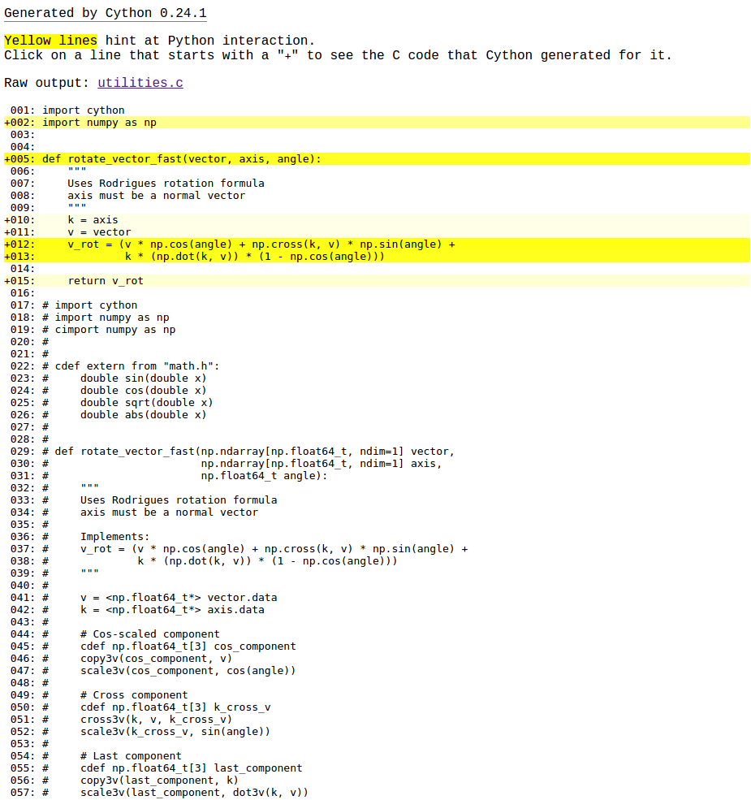
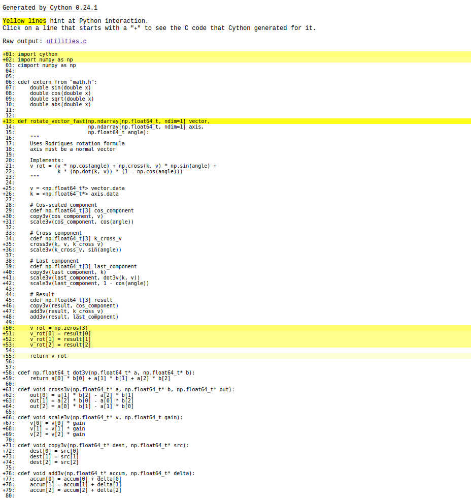

+++
title = "Deskbot Part 5, Optimization"
date = 2016-07-31
[taxonomies]
tags = ["robotics", "raspberry pi", "cython", "python"]
[extra]
katex = true
+++

Now that we have a basic inverse kinematic model, the sky's the limit.  Wait.  The horsepower of a Raspberry Pi Model A is a pretty good limit.  In this video, the eye vector is tracing out a circle, trying to hold 1 second per circle.

<!-- more -->

<iframe src="https://player.vimeo.com/video/176958711" width="640" height="480" frameborder="0" webkitallowfullscreen mozallowfullscreen allowfullscreen></iframe>

As you can see, it's not particulary smooth.  Here is the core logic of this behavior:

```python
def behavior(pbs, full_ik, f_v, t, freq):
    start_time = time.time()
    y_t = 0.3 * np.cos(2 * np.pi * freq * t)
    z_t = 0.3 * np.sin(2 * np.pi * freq * t)
    e_v = np.array([1, y_t, z_t])
    e_v = e_v / np.linalg.norm(e_v)

    angles = full_ik.solve(e_v, f_v, height)
    set_servo_angles(pbs, angles)

    dt = time.time() - start_time
    t += dt
    print(dt)
    return t

if __name__ == "__main__":
    ...
    t = 0
    dt = 0
    freq = 1.0

    while True:
        # pbs = PiBlasterServos object
        # full_ik = System IK solver
        # f_v = "ear" vector, "eye" vector will be solved in the behavior
        t = behavior(pbs, full_ik, f_v, t, freq)
```

We have to be careful when using `print` to report information while benchmarking, because it can be relatively slow itself and skew the results.  However, in my terminal, I'm seeing `dt`s on the order of 75 ms, which is slow enough that `print` isn't getting in the way.

## Finding the Low-Hanging Fruit

A big reason I am developing this robot in Python is that it lets me iterate rapidly in fairly readable code.  I don't want to waste my time prematurely optimizing functions that aren't having a significant impact on the run-time.

To get a better idea of what's going on, we need to use Python's [profile module](https://docs.python.org/2/library/profile.html).  In this case, we're going to use `cProfile` which is recommended in most cases because it has significantly less overhead compared to the pure Python `profile` module.

Modify the code slightly to profile `behavior`:

```python
import cProfile as profile
...

if __name__ == "__main__":
    ...
    while True:
        profile.run("t = behavior(pbs, full_ik, f_v, t, freq)")
```

Now, everytime the function is called, profiling information will be printed.

```bash
         327 function calls in 0.157 seconds

   Ordered by: standard name

   ncalls  tottime  percall  cumtime  percall filename:lineno(function)
        1    0.000    0.000    0.157    0.157 <string>:1(<module>)
        2    0.000    0.000    0.000    0.000 fromnumeric.py:1211(shape)
        1    0.002    0.002    0.126    0.126 full_ik.py:14(solve)
        4    0.000    0.000    0.008    0.002 function_base.py:979(interp)
        3    0.002    0.001    0.018    0.006 leg_ik.py:12(solve)
        3    0.014    0.005    0.014    0.005 leg_ik.py:37(two_link_from_origin_ik)
        3    0.000    0.000    0.001    0.000 leg_ik.py:5(__init__)
        2    0.001    0.000    0.001    0.000 linalg.py:1840(norm)
        1    0.000    0.000    0.015    0.015 minpack.py:12(_check_func)
        1    0.000    0.000    0.096    0.096 minpack.py:30(fsolve)
       13    0.006    0.000    0.011    0.001 numeric.py:1128(cross)
       30    0.001    0.000    0.002    0.000 numeric.py:167(asarray)
        1    0.000    0.000    0.000    0.000 numeric.py:237(asanyarray)
        4    0.000    0.000    0.028    0.007 pi_blaster_servos.py:20(__setitem__)
       11    0.020    0.002    0.081    0.007 platform_ik.py:104(errors)
        1    0.001    0.001    0.002    0.002 platform_ik.py:21(rotation_matrix)
       33    0.020    0.001    0.020    0.001 platform_ik.py:41(point_line_distance)
        1    0.002    0.002    0.103    0.103 platform_ik.py:63(solve)
       12    0.019    0.002    0.039    0.003 platform_ik.py:8(rotate_vector)
        4    0.000    0.000    0.008    0.002 servo.py:11(period_for_angle)
        1    0.001    0.001    0.028    0.028 servo_ik_benchmark.py:19(set_servo_angles)
        1    0.002    0.002    0.157    0.157 servo_ik_benchmark.py:27(behavior)
        1    0.000    0.000    0.000    0.000 shape_base.py:6(atleast_1d)
        1    0.000    0.000    0.000    0.000 {any}
        4    0.000    0.000    0.000    0.000 {isinstance}
        3    0.000    0.000    0.000    0.000 {len}
        1    0.000    0.000    0.000    0.000 {math.cos}
        1    0.000    0.000    0.000    0.000 {math.sin}
        1    0.000    0.000    0.000    0.000 {math.sqrt}
        5    0.000    0.000    0.000    0.000 {method 'append' of 'list' objects}
        6    0.000    0.000    0.000    0.000 {method 'astype' of 'numpy.ndarray' objects}
        2    0.000    0.000    0.000    0.000 {method 'conj' of 'numpy.ndarray' objects}
        1    0.000    0.000    0.000    0.000 {method 'disable' of '_lsprof.Profiler' objects}
        4    0.000    0.000    0.000    0.000 {method 'format' of 'str' objects}
        4    0.000    0.000    0.000    0.000 {method 'item' of 'numpy.ndarray' objects}
        2    0.000    0.000    0.000    0.000 {method 'ravel' of 'numpy.ndarray' objects}
        2    0.000    0.000    0.000    0.000 {method 'reduce' of 'numpy.ufunc' objects}
       26    0.000    0.000    0.000    0.000 {method 'swapaxes' of 'numpy.ndarray' objects}
        4    0.019    0.005    0.019    0.005 {method 'write' of 'file' objects}
        3    0.000    0.000    0.000    0.000 {min}
       43    0.011    0.000    0.011    0.000 {numpy.core._dotblas.dot}
       69    0.012    0.000    0.012    0.000 {numpy.core.multiarray.array}
        3    0.000    0.000    0.000    0.000 {numpy.core.multiarray.zeros}
        4    0.007    0.002    0.007    0.002 {numpy.lib._compiled_base.interp}
        1    0.000    0.000    0.000    0.000 {range}
        1    0.014    0.014    0.081    0.081 {scipy.optimize._minpack._hybrd}
        2    0.000    0.000    0.000    0.000 {time.time}
```

The function is now taking almost twice as long as it was before, which is due to the overhead of the profiler.  The column we're most interested in is "tottime," which is the total amount of time spent in each function, not including function calls within it.  Functions that are called many times, "ncalls," are and high "tottime" are really good candidates for optimization since small improvements in frequently called functions will add up.  `point_line_distance` and `rotate_vector` look like good candidates.  Since we have the benchmarking info from our target system, we can move back to a normal desktop PC to avoid having to develop over SSH.  Since my PC's a good deal faster than the RPi, we need a more aggressive test case:

```python
import cProfile as profile
from numpy import radians, array
from kinematics.inverse.platform_ik import rotate_vector

if __name__ == "__main__":
    e_v = array([1, 0, 0])
    gy_v = array([0, 1, 0])
    angle = radians(10)

    profile.run("for i in range(10000): rotate_vector(e_v, gy_v, angle)")
```

The profile output is:

```bash
         150003 function calls in 0.382 seconds

   Ordered by: standard name

   ncalls  tottime  percall  cumtime  percall filename:lineno(function)
        1    0.007    0.007    0.382    0.382 <string>:1(<module>)
    30000    0.028    0.000    0.028    0.000 numeric.py:1404(rollaxis)
    10000    0.155    0.000    0.217    0.000 numeric.py:1553(cross)
    20000    0.011    0.000    0.014    0.000 numeric.py:414(asarray)
    10000    0.144    0.000    0.375    0.000 platform_ik.py:8(rotate_vector)
    20000    0.002    0.000    0.002    0.000 {len}
        1    0.000    0.000    0.000    0.000 {method 'disable' of '_lsprof.Profiler' objects}
    30000    0.010    0.000    0.010    0.000 {numpy.core.multiarray.array}
    10000    0.014    0.000    0.014    0.000 {numpy.core.multiarray.dot}
    10000    0.007    0.000    0.007    0.000 {numpy.core.multiarray.empty}
    10000    0.003    0.000    0.003    0.000 {numpy.core.multiarray.promote_types}
        1    0.000    0.000    0.000    0.000 {range}
```

The majority of our time is spent in `rotate_vector` and `cross`.  The later is part of numpy, so there's not much to do there.  The former we have some control over, but it's pretty much just Python assignments.

## Cython
Function `rotate_vector`'s pretty much as optimized as it gets in Python.  It's purely assignments, basic mathematics, and vector operations that are already delegated to a very fast library.  We're going to sidestep Python by using Cython, which is an "optimising static compiler" for both Python and a C-like Cython programming language.  This is not to be confused with CPython which is the popular implementation of the Python interpreter written in C, or compiling a C executible and calling it from python.  It is safest to think of Cython as a compiled language that has Python-like and C-like attributes, that is designed to interoperate with Python code while achieving compiled-language performance.

To install Cython, we need a full C development environment.  On Linux for Python 2.7, this is straightforward, remembering to make sure we also install development headers for the libraries we're using:

```bash
sudo apt-get install build-essential libpython2.7-dev
sudo pip install cython
```

Since `rotate_vector` is a function we'll probably use somewhere else, we'll make a new file to hold it: `utilities.pyx`.  The "x" at the end signifies that this is a Cython file and not pure python.

```python
import cython
import numpy as np


def rotate_vector_fast(vector, axis, angle):
    """
    Uses Rodrigues rotation formula
    axis must be a normal vector
    """
    k = axis
    v = vector
    v_rot = (v * np.cos(angle) + np.cross(k, v) * np.sin(angle) +
             k * (np.dot(k, v)) * (1 - np.cos(angle)))

    return v_rot
```

Modify `benchmark_rotate_vector.py` to build and call our new Cython file:

```python
import cProfile as profile
from numpy import radians, array
from kinematics.inverse.platform_ik import rotate_vector
import pyximport
pyximport.install()
from kinematics.inverse.utilities import rotate_vector_fast

if __name__ == "__main__":
    e_v = array([1, 0, 0])
    gy_v = array([0, 1, 0])
    angle = radians(10)

    profile.run("for i in range(10000): rotate_vector(e_v, gy_v, angle)")
    profile.run("for i in range(10000): rotate_vector_fast(e_v, gy_v, angle)")

```

Running the benchmark, `rotate_vector` and `rotate_vector_fast` take 0.379 and 0.377 ms respectively.  That's not a great improvement.  What happened to our compiled-langauge performance?  To create sigificant improvements, Cython needs to have some more information.  Cython has a great utility to help track down where we're getting Python performance vs. C performance.  Running `cython -a code/kinematics/inverse/utilities.pyx` generates an HTML report, where lines highlighted in yellow have heavy Python overhead.



Lines 12 and 13 have a lot of overhead.  The first thing we can try is using native C calls for the trig. functions, rather than numpy's.


```python
import cython
import numpy as np


cdef extern from "math.h":
    double sin(double x)
    double cos(double x)


def rotate_vector_fast(vector, axis, angle):
    """
    Uses Rodrigues rotation formula
    axis must be a normal vector
    """
    k = axis
    v = vector
    v_rot = (v * cos(angle) + np.cross(k, v) * sin(angle) +
             k * (np.dot(k, v)) * (1 - cos(angle)))

    return v_rot
```

The `cdef` statement is used to declare C functions and variables.  The `cdef extern` at the beginning of the file is used to make the native C functions avaialable for use in both `def` functions (Python), and `cdef` functions (C).  Running the benchmark, the Cython implementation takes 0.347 seconds vs. 0.391 seconds for the native Python.  The profile information varies a bit on each run, but we're already seeing an improvement.

Next we'll give Cython some information on our data types.  To use typing with the Numpy types, we need to `cimport` the module.  If you get errors about missing Numpy header files, you may need to modify benchmark file to look for the headers where they were actually installed to, rather than where Cython expects them by default:

```python
pyximport.install(setup_args={'include_dirs': numpy.get_include()})
```

However, if we try to build the following, we'll get errors:

```python
import cython
import numpy as np
cimport numpy as np

cdef extern from "math.h":
    double sin(double x)
    double cos(double x)


def rotate_vector_fast(np.ndarray[np.float64_t, ndim=1] vector,
                       np.ndarray[np.float64_t, ndim=1] axis,
                       np.float64_t angle):
    """
    Uses Rodrigues rotation formula
    axis must be a normal vector
    """
    k = <np.float64_t*> axis
    v = <np.float64_t*> vector
    v_rot = (v * cos(angle) + np.cross(k, v) * sin(angle) +
             k * (np.dot(k, v)) * (1 - cos(angle)))

    return v_rot
```

For performance, we've converted the input vectors into floating point vectors with very little overhead.   Unfortunately, that means we no longer have access to the basic Numpy array mathematical helpers.  All of these math operations can be rewritten:

```python
import cython
import numpy as np
cimport numpy as np


cdef extern from "math.h":
    double sin(double x)
    double cos(double x)
    double sqrt(double x)
    double abs(double x)


def rotate_vector_fast(np.ndarray[np.float64_t, ndim=1] vector,
                       np.ndarray[np.float64_t, ndim=1] axis,
                       np.float64_t angle):
    """
    Uses Rodrigues rotation formula
    axis must be a normal vector

    Implements:
    v_rot = (v * np.cos(angle) + np.cross(k, v) * np.sin(angle) +
             k * (np.dot(k, v)) * (1 - np.cos(angle)))
    """

    v = <np.float64_t*> vector.data
    k = <np.float64_t*> axis.data

    # Cos-scaled component
    cdef np.float64_t[3] cos_component
    copy3v(cos_component, v)
    scale3v(cos_component, cos(angle))

    # Cross component
    cdef np.float64_t[3] k_cross_v
    cross3v(k, v, k_cross_v)
    scale3v(k_cross_v, sin(angle))

    # Last component
    cdef np.float64_t[3] last_component
    copy3v(last_component, k)
    scale3v(last_component, dot3v(k, v))
    scale3v(last_component, 1 - cos(angle))

    # Result
    cdef np.float64_t[3] result
    copy3v(result, cos_component)
    add3v(result, k_cross_v)
    add3v(result, last_component)

    v_rot = np.zeros(3)
    v_rot[0] = result[0]
    v_rot[1] = result[1]
    v_rot[2] = result[2]

    return v_rot


cdef np.float64_t dot3v(np.float64_t* a, np.float64_t* b):
    return a[0] * b[0] + a[1] * b[1] + a[2] * b[2]

cdef void cross3v(np.float64_t* a, np.float64_t* b, np.float64_t* out):
    out[0] = a[1] * b[2] - a[2] * b[1]
    out[1] = a[2] * b[0] - a[0] * b[2]
    out[2] = a[0] * b[1] - a[1] * b[0]

cdef void scale3v(np.float64_t* v, np.float64_t gain):
    v[0] = v[0] * gain
    v[1] = v[1] * gain
    v[2] = v[2] * gain

cdef void copy3v(np.float64_t* dest, np.float64_t* src):
    dest[0] = src[0]
    dest[1] = src[1]
    dest[2] = src[2]

cdef void add3v(np.float64_t* accum, np.float64_t* delta):
    accum[0] = accum[0] + delta[0]
    accum[1] = accum[1] + delta[1]
    accum[2] = accum[2] + delta[2]
 ```

Because we are working with vectors of a known, fixed length, rewritting the vector functions is straightfoward, if not elegant.  In order to get this to run, though, the benchmark must be modified:

```python
if __name__ == "__main__":
    e_v = array([1., 0., 0.])
    gy_v = array([0., 1., 0.])
    angle = radians(10.)

	...
```

It's a subtle change.  All of the input varaibles now have a trailing "." to make sure Python represents them as a floating point number.  If we were pass in an integer value, Python would pass a "long" type to Cython.  Since we've optimized out the checks and conversions of types, this would crash the program.  For this inconvenience, though, we are rewarded by a large performance improvement: 26 ms in Cython vs. 367 ms in Python.  That's better than an order of magnitude improvement!  Rerunning `cython -a`, the mathematics no longer have significant overhead:



We still have a little bit of overhead in our conversion from C types back to a Numpy array, but we've hit the low-hanging fruit in this function.  This is just scratching the surface of what Cython can do.

## Back to the RPi

Let's get our benchmark running on the RPi.  This requires a little leg-work, as the version of Cython pre-built for the RPi is too old.  First, I had to increase the size of the swap file to 1 GB by changing `/etc/dphys-swapfile` to have `CONF_SWAPFILE=1024`.  Then restart the swap file using the following:

```bash
/etc/init.d/dphys-swapfile stop
/etc/init.d/dphys-swapfile start
```

I was then able to build and install Cython using `sudo pip install cython`, though it took over an hour.  


Before we run it on the more limited hardware, we want to make sure that the number of calls to each function-under-test is more conservative.  On my original RPi hardware, I only performed 100 calls for each: 22 ms in Cython and 346 ms in Python.  Although the overall performance is 100 times slower than my desktop, we are still getting a huge speed boost from Cython.

For convenience, I modified the benchmark to accept an argument with the number of times it should be run to make going between my desktop and RPi easier:

```python
if __name__ == "__main__":
    e_v = array([1., 0., 0.])
    gy_v = array([0., 1., 0.])
    angle = radians(10.)

    if len(sys.argv) > 1:
        runs = int(sys.argv[1])
    else:
        runs = 1

    profile.run("for i in range(runs): rotate_vector(e_v, gy_v, angle)")
    profile.run("for i in range(runs): rotate_vector_fast(e_v, gy_v, angle)")
```


## Conclusions
After repeating this process on a number of other functions in the inverse kinematics, there are signicant improvements.  Running `servo_ik_benchmark.py` now only takes 44 ms compared to 157 ms from when we stared.  After removing the profiling overhead, the printed `dt` is around 36 ms, less than half of what it was previously.  The following video shows the robot after optimization.

<iframe src="https://player.vimeo.com/video/176982689" width="640" height="480" frameborder="0" webkitallowfullscreen mozallowfullscreen allowfullscreen></iframe>

While Python has significant challenges in real-time systems, the ability to write high-level code and then dive into optimization only when necessary is hard to over-emphasis for robotics applications.  Where other languages allow bindings to C libraries, Cython is a really cool system for not making you switch tool-chains mid-project.
