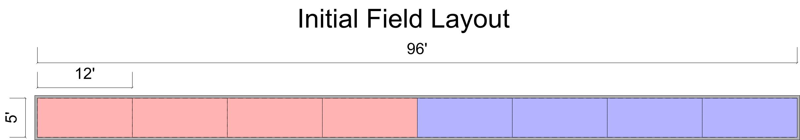
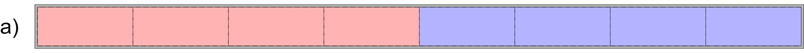
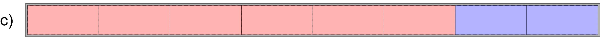
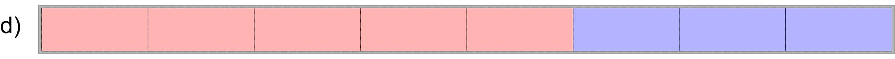
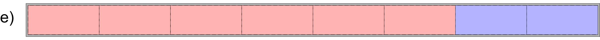
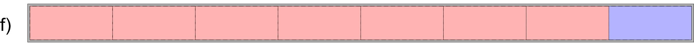

+++
title = "Dodge-Card Soccer"
date = 2009-10-15
[taxonomies]
tags = ["games"]
+++

Force a player to the last of his zones by striking him with a card (or other object) while the bottle-cap is in one of his own zones.  Or:

> Well, we ate all the pizza.  What are we going to do with the box, 2 liter bottle cap, and chem lab goggles?

<!-- more -->

# Field Setup
The field is a walled rectangle 96 x 5 feet, divided every 12 feet with 7 dividing lines.

# Equipment
* 1 Plastic-cap (puck)
* 10 (minimum) Dodge-cards – Preferably Outback Steakhouse Bloomin’ Onion Coasters or other 4” square cardboards with rounded corners.
* Cone or other marker (optional) used to mark current Zone Split

# Safety
Due to the projectile-hucking nature of the game, this game should be played wearing chemistry goggles and a t-shirt like a ninja-mask.

1. Play is divided into two or more rounds: in the first round initial puck control is determined by the winner of a coin toss. In the second round the opposite player receives the puck at the start.
    1. The winner of the toss may choose to retain initial control or forfeit it to his opponent
    2. If he forfeits he will be given control at the start of the next round
After the first two rounds, initial control alternates between players
2. Play begins by allowing the player having won initial puck control to position the puck anywhere in his territory. His territory consists of all the rectangular “zones” 12 x 5 feet. Each player initially starts with 4 zones under his control.
    1. The boundary line is the where two opponent’s zones meet
    2. Zones are not indefinitely controlled by a player, they are shifted back and forth according to (III)
3. A player may take control of an enemy zone by:
    1. Striking an enemy with a live dodge-card without the opponent catching it
        1. A dodge-card is considered “live” if it is in flight
        2. Any card not moving or sliding along the ground is considered “dead”
        3. A flying dodge-card is still live after colliding with the walls, floor, ceiling, or another player
        4. If a card leaves the field it is considered dead and may be returned to the intersection of the two player’s territories at the official’s discretions
    2. Catching an enemy thrown dodge-card that is live
        1. Holding an enemy thrown dodge-card above the floor with the card in direct contact of the wall or ceiling is known as “pinning”
        2. A pinned card is considered dead, and, once released or freely held by the player who had pinned it, is not considered a catch or a strike and play continues
        3. A live card thrown by the opponent that is supported only by the player’s body is considered a catch.  A player may be in contact with the walls at time of the catch as long as the card in question is not
    3. An enemy violates the boundary between the two territories
        1. A player’s territory is violated if an opponent touches the floor of any of the player’s zones
        2. An opponent may reach across the boundary and make contact only with a dodge-card that lies partially in both opponent’s zones
    4. Methods (a) and (b) may are only valid for a player while the puck lies in the opponent’s territory (i.e. a player must first move the puck into his enemy’s territory before attempting to strike him with a dodge-card). A strike or catch do no not effect play if made by the player with the puck in his territory.
        1. The puck may be struck by dodge-cards accidentally or intentionally
    5. Dodge-cards may be deflected using another dodge-card. The player may drop the shielding dodge-card in the process of deflecting. Neither case is considered a strike.
4. When a player is awarded control of an adjacent enemy zone by the methods outlined in (III) the opponent may place the puck anywhere in the territories he still controls. Play continues as soon as the opponent kicks the pick across the new boundary line.
    1. While it is not necessary to mark the current boundary line as it will shift often, it may be as long as the markings are unobtrusive to play
5. When a player controls all of the zones except one remaining to his opponent         (III) does not apply to him
    1. (III) continues to apply to the player in his last zone
    2. The player with the majority of zones may win the round by moving the puck so it hits the wall in back of his opponent
        1. A player may not win a round without controlling all but one zones
        2. Striking an opponent with a card does not allow the player to win the round
        3. If the opponent legally strikes the player trying to win the round he gains the adjacent cell of his enemy as usual and is now no longer in danger of loosing the round. Play continues as usual.
6. Violations and Misconducts
    1. Warnings – A player accruing two warnings of any type in the same round surrenders a zone along the boundary line to his opponent. This process continues for every two consecutive warnings. All warnings (unless otherwise stated) may be given at any point of play. Play stops after a warning is given. Play is restarted by giving the player who did not earn the warning control of the puck.
        1. Handling – player willfully or accidentally contacts the puck with his wrist or hand
        2. Stepping – player crosses the boundary in a minor fashion (unintentional). If directly results in a strike or catch, the strike or catch are invalidated and play continues.
        3. Bounding – using the walls of the field to remain in off the floor longer than appropriate when dodging
        4. Filibustering – Allowing the puck and all dodge-cards to remain in the player’s own territory for longer than 5 seconds
    2. Minor Fouls – Minor fouls result in an automatic loss of the current round
        1. Objective Misconduct – intentional violation of a matter of play
        2. Personal Misconduct – improper treatment of a player, referee, equipment, or field
        3. Accrue 6 or more warnings in a round
    1. Major Fouls – Result in a loss of the game
        1. Accrue 2 or more minor fouls in a game
        2. Willful and destructive behavior not in conjunction with the appropriate nature of play and sportsmanship
            1. Must be called by a referee and confirmed by two separate referees or officials
    4. The referee has all jurisdiction in applications of the rules.

# Example Game
The following is an example depicting the play of a single round of a game of Dodge-card soccer.

Each player starts with their 4 zones, dividing the field into two territories with a boundary line at their intersection:

The red player wins the coin toss and chooses to have puck control in the first round. He kicks the puck over the line. The red player quickly attempts to strike the blue player and steps on the boundary line and earns a Stepping Warning. Play restarts giving the blue player control of the puck. He kicks it across the line and misses striking the red player. The red player kicks it back into blue territory and the blue player tries to catch but only deflects a dodge-card. The red player advances one zone:

The blue player kicks off and play continues until the red player kicks the puck into the blue territory and strikes the blue player:

The blue player kicks off and launches the puck into the air where the red player hits it with his hand by reaction, earning a Handling Warning. Being the second warning for the red player in this round, the blue player gains a zone and is given puck control:

The blue player kicks off but the red player eventually kicks the puck into blue territory and strikes the blue player:

Again the blue player kicks off and is legally struck:

The blue player kicks the puck but steps over the boundary line, earning a Stepping Warning. The red player is given puck control and the blue player fails to block the initial kick which hits the wall in back of him. The red player wins round 1.

The game has one more round in which the field is again divided and the blue player is given puck control.
