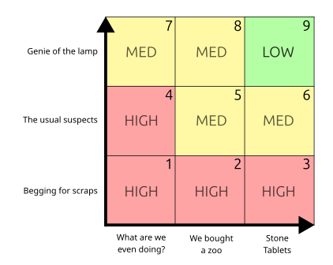

+++
title = "Assessing Execution Risk"
date = 2025-07-20
[taxonomies]
tags = ["project management"]
+++

Your deliverables are sliding. You rebaselined and the team looks busy, but it's still moving right half a day, every day. Or management approved your new charter, the work breakdown was thorough, dependencies were set, and a month in, the [CPI](https://en.wikipedia.org/wiki/Earned_value_management#Cost_performance_index_(CPI)) is 0.5. You and your team aren't executing.

[Risk registers](https://en.wikipedia.org/wiki/Risk_register) document the likelihood, severity, and mitigations for risks to a specific project. They can be supported by a [probability/impact matrix](https://en.wikipedia.org/wiki/Risk_matrix) to prioritize the register. [Technical readiness level](https://en.wikipedia.org/wiki/Technology_readiness_level) can be used to assess the maturity of a technology before you commit that this project will be a cakewalk. However, these are mostly looking at a project in particular, require a deep-dive into the solution, or require a crystal ball.

How can I compare multiple very different projects for their "execution risk," the low/medium/high likelihood that the project will not happen as expected?

# Objective

Let's make a tool for estimating execution risk that is simple enough to use in the germ-of-an-idea phase but is still useful for communication. Especially, we want a tool that can visualize a portfolio of projects and identify why one project is succeeding while another flounders. The tool should predict fires before they happen and help prioritize fire extinguishers when they do.

# Resource Control

I'm lumping everything to do with personnel, equipment, and capital into a single "resource control" scale. Since not approving purchases orders is a black/white decision from upper management, that is already simple to communicate. Personnel are a bigger discussion gap.

From most problematic to best-case scenario, the scale goes:

1. Begging for scraps

The dev team said the fires on Project X should be put out before you need them, so don't worry. I'm pretty sure we have leftover hardware from Project Y that's compatible, so you won't need to buy new.

2. The usual suspects

Real names are assigned to your team and lab benches are cleared and ready. Yeah, most of those names are also on Jane's team, but nobody is over allocated. They've been with the organization a few years and their titles match the tasks. They've dealt with conflicts before.

3. Genie of the lamp

Your team enjoys performing magic, and they can only do it for you.

# Scope Control

Again, we'll make a simple scale that is all gut feeling and no microscopy.

1. What are we even doing?

Kinda feeling it out as we go, you know? I've heard of other companies using this toolchain. How hard could it be? We'll rebuild the schedule as we learn more.

2. We bought a zoo

This isn't as bad as it sounds, and I'd argue this is typical for many successful projects. You know what you want, the basics are clear and researchable. There are people with expertise that can fill in the gaps if we struggle. However, key stakeholders are willing to throw poo.

3. Stone tablets

There are clearly defined (for the sake of metaphor) rules dropped in your lap, and the customer is just as afraid of being struck by lightning for deviating as you are.

# The Playing Field

Taking the two axes, the result is:

* Low execution risk - The project is expected achieve the goals of the charter on the scheduled dates.
* Medium execution risk - The project is expected to get there and will work through uncomfortable bumps along the way.
* High execution risk - The project is expected to severely overrun costs and schedules. There might be big scope impacts. The bruising will be painful and the project might fail.

And this how it shakes out:

* 1, 2, 3: You are in the bottom row, and it *always* goes off the rails. You can't execute without a team.
* 4: Even if you have a team, they won't succeed if the goalposts aren't there.
* 5, 6: a typical organization team in a typical organization project should have the benefit of the doubt, but a watchful eye.
* 7: The right people find a way to succeed, as often as not.
* 8: Even the best people can be derailed by indeterminate or changing scope.
* 9: Wouldn't this be nice?

Is this based on cuantitative data or rigorous first principles? Not really. But take the project you're currently managed and put it on the grid. See how it feels. Put another project in the organization on the grid and look at the relationship. Periodically re-evaluate if you still are in the box you think you are, and what you can do to move up and to the right.