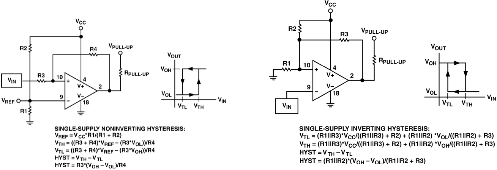

+++
title = "Implementing Comparators with Hysteresis"
date = 2014-01-19
[taxonomies]
tags = ["electronics", "comparator", "hysteresis"]
[extra]
katex = true
+++

You need to implement a comparator circuit with hysteresis, and you pull up some app notes.  They look something like this, [credit to Analog Devices](http://www.analog.com/library/analogdialogue/archives/34-07/comparators/):

<!-- more -->

If you have a circuit in hand, there are a dozen or so discussions online to determine the comparator’s characteristics: high threshold $V_{TH}$, low threshold $V_{TL}$, and hysteresis $V_{HYST}$.  We asume that $R_{PULL-UP}$ is reasonably small compared to the feedback network so that $V_{OH}$ is fixed.  These equations are pretty easy to derive yourself from basic circuit principles, but it’s a time saver to have them available.  Now, if you want to design your comparator circuit, and already know it’s characteristics, you have to either guess and check values, implement a solver, or do some basic algebra to solve the equations to get the resistor values in terms of the comparator’s characteristics.  Every time I do this, I lose my notes, so this time, they’re going online.

Assumptions

Going into these solutions, we’re going to assume that the circuit designer knows the following:

* $V_{TH}$
* $V_{TL}$
* $V_{HYST}$ – the difference between $V_{TH}$ and $V_{TL}$
* $V_{OH}$ – the voltage at pin 2 when the output is high.  For comparators with an open-comparator output and a small $R_{PULL-UP}$ with respect to the feedback network, this will be $V_{PULL-UP}$
* $V_{OL}$ – the voltage at pin 2 when the output is low.  For comparators with an open-ground output, this will be 0 or near 0.
I’m going to assume that $V_{PULL-UP}$ is tied to $V_{CC}$.

Also, you will be picking some resistor values to make the equations solvable.  They are somewhat arbitrary, but should be chosen as a trade-off between wasting current making the feed-back network to small with respect to $V_{PULL-UP}$.  If you are designing on a PCB, choosing resistors that are too large may lead to PCB leakage having a significant effect on accuracy.

Single-supply Noninverting Hysteresis

This is the easiest of the two comparator types because the hysteresis equation is dependent only on $R_3$ and $R_4$.  Choosing an arbitrary $R_3$, we have:

$$
R_4 = \frac{R_3(V_{OH}-V_{OL})}{R_4}
$$

Then, we can do some math to determine $V_{REF}$ as a function of the trip-point, which is halfway between $V_{TH}$ and $V_{TL}$.  Note that $V_{REF}$ is not the same as $V_{TRIP}$.

$$
V_{REF} = \frac{ 2 R_4 V_{TRIP} + R_3(V_{OH}+V_{OL}) }{ 2R_3 + 2 R_4 }
$$

Once you have $V\_{REF}$, finding $R1$ and $R2$ is just solving a voltage divider.  Choosing an arbitrary $R1$:

$$
R_2 = R_1\left(\frac{V_{CC}}{V_{REF}}-1\right)
$$

Single-supply Inverting Hysteresis

This one is more aggravating because the hysteresis feedback and trip voltage networks interact.  The trick (there might be a better one) is to rearrange $V_{TL}$ and $V_{TH}$ like so:

$$
V_{TH} = \frac{R_1 R_3 V_{CC} + R_1 R_2 V_{OH}}{R_1 R_2 + R_1 R_3 + R_2 R_3}
V_{TL} = \frac{R_1 R_3 V_{CC} + R_1 R_2 V_{OL}}{R_1 R_2 + R_1 R_3 + R_2 R_3}
$$

Then you can divide these equations to end up with $R_2$ and $R_3$ being your only unknowns:

$$
\frac{V_{TH}}{V_{TL}} = \frac{ R_3 V_{CC} + R_2 V_{OH} }{ R_3 V_{CC} + R_2 V_{OL} }
$$

You end up with:

$$
R_3 = \frac{R_2(V_{TL}V_{OH}-V_{TH}V_{OL})}{ V_{CC}(V_{TH} – V_{TL}) }
$$

We can use this relationship to find $R_2$ in terms of only $R_1$:

$$
R_2 = R_1 \left[\frac{V_{CC}V_{HYST}(V_{OL}-V_{TL})}{V_{TL}(V_{TL}V_{OH}-V_{TH}V_{OL})}+\frac{V_{CC} – V_{TL}}{V_{TL}}\right]
$$

So, choose $R_1$, then solve for $R_2$ and $R_3$ consecutively.

Here’s pictures with the work if anyone’s curious or finds mistakes.

* [Non-inverting](noninverting.jpg)
* [Inverting 1 of 3](inverting_1_of_3.jpg)
* [Inverting 2 of 3](inverting_2_of_3.jpg)
* [Inverting 3 of 3](inverting_3_of_3.jpg)
