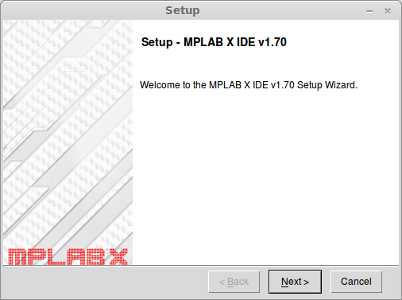
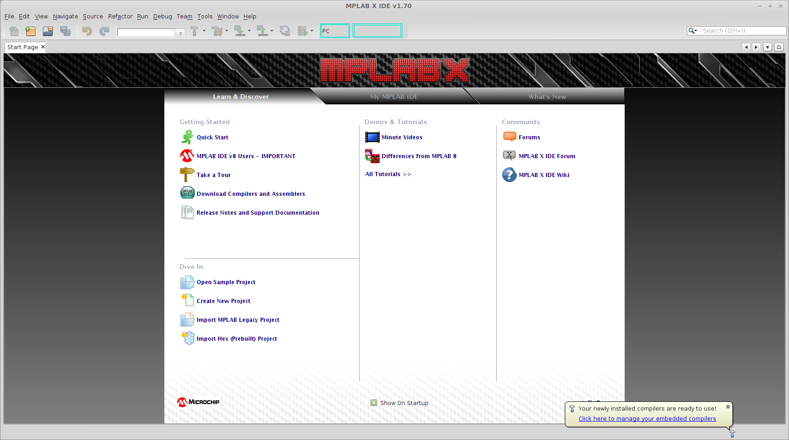
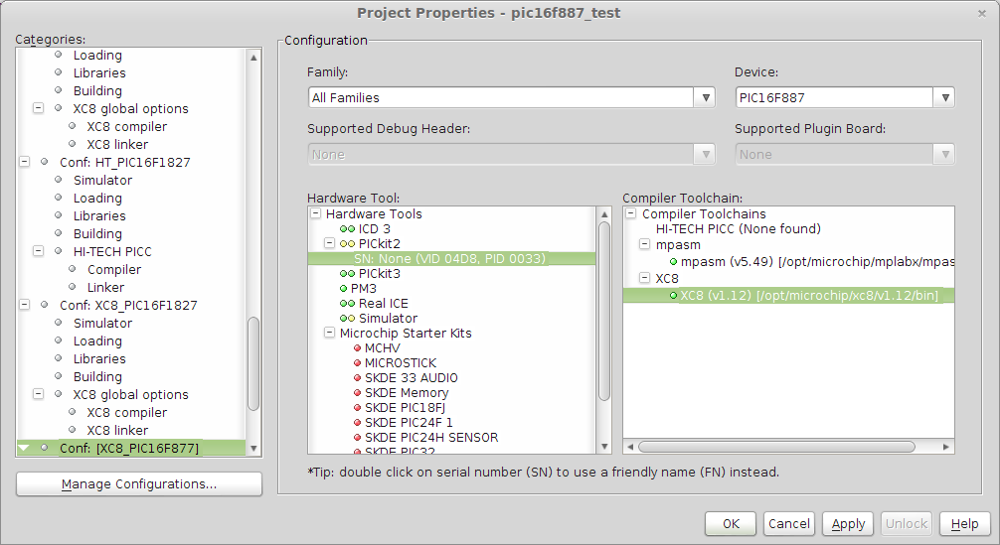

+++
title = "Installing MPLAB X and PICkit2 on Ubuntu"
date = 2013-03-28
[taxonomies]
tags = ["uav", "mplab x", "pickit2", "xc8"]
+++

In order to create the UAV flight control system from scratch, we’re going to need a microcontroller and a tool chain that is Linux compatible.  Since we know we’re going to be dealing with servo control signals, input capture (good for reading pulse widths), and PWM modules are going to be important in our device selection.  [Microchip](http://www.microchip.com/) has a huge variety of microcontrollers available, and I have my eye on their dsPIC33 series because of the DSP hardware and variety of peripherals.  Also, I have some experience using them in previous hobby projects, as well as my Senior Design.  Best of all, I still have a PICkit2 emulator and PIC16F887 development board stashed away.

<!-- more -->

# Installation

Download the installer from http://www.microchip.com/pagehandler/en-us/family/mplabx/#downloads. The installer is for both 64-bit and 32-bit systems, but if you are on a 64-bit system, you must first install the 32-bit compatibility libraries.

```sh
sudo apt-get install ia32-libs
```

Allow executing the downloaded script and run it.

```sh
chmod +x MPLABX-v1_70-linux-installer.run
sudo ./MPLABX-v1_70-linux-installer.run
```

Follow the fancy wizard. I installed to the default location (/opt/microchip/mplabx).



The wizard recommends rebooting after installation, but lets see how far we can get first. First, we’re going to install one of the compilers from http://www.microchip.com/MPLABxc. Since I’m interested in working with a PIC16F887 8-bit microcontroller, I’m going to install the XC8 compiler from http://www.microchip.com/mplabxc8linux.  You’ll need to mark the script executable and run it like we did for the IDE.  Make sure to configure the compiler in free mode.  We can activate the pro evaluation license down the road if desired, but it times out after 60 days.

If all goes well, when MPLAB X IDE is started (available in the launcher), it will indicate that it has found the compiler that was installed.



On Linux Mint with Cinnamon, I’m experiencing the symptoms described by https://github.com/linuxmint/Cinnamon/issues/473, but I can worry about that later.

# Configuration

Create a new “PIC16 C Template” project from the “Samples/Microchip Embedded” category. There may be some configuration loading errors because the default project wants the “hi-tech-picc” build tool-chain. Open the tool-chain configuration from Run –> Set Project Configuration –> Customize…

Click Manage Configurations.., duplicate “XC8_PIC16F54,” and rename it to “XC8_PIC16F887.” Set it active. Select this new configuration from the Categories pane. In the configuration tab, change the family to Mid-Range 8-bit MCUs. Change the device to PIC16F887.  With the XC8 compiler installed, I get mostly green lights, and even the PICkit2 seems to be recognized.



Use Run –> Build Main Project to verify that the project can be successfully built. From Debug –> Debug Main Project, I can enter emulation, and pause and restart the program. I had to OK MPLAB changing the configuration settings to meet:

Watchdog Timer Enable bit = On
Low Voltage Programming Enable bit = RB3/PGM pin has PGM function, low voltage programming enabled

Modifying the stock main.c file a bit, we can make LED 0 blink:

```
/* Files to Include */
#if defined(__XC)
#include <xc.h> /* XC8 General Include File */
#elif defined(HI_TECH_C)
#include <htc.h> /* HiTech General Include File */
#endif

#include <stdint.h> /* For uint8_t definition */
#include <stdbool.h> /* For true/false definition */

#include "system.h" /* System funct/params, like osc/peripheral config */
#include "user.h" /* User funct/params, such as InitApp */

/* User Global Variable Declaration */
#define _XTAL_FREQ 4000000 // Default internal oscillator frequency

/* i.e. uint8_t <variable_name>; */

/* Main Program */
void main(void)
{
  /* Configure the oscillator for the device */
  ConfigureOscillator();

  /* Initialize I/O and Peripherals for application */
  InitApp();

  TRISD = 0; // Set port D as output

  // Blink once per second
  while(1)
  {
    PORTD=0x01;
    __delay_ms(200);
    PORTD=0x00;
    __delay_ms(800);
  }
}
```
<p><iframe src="https://player.vimeo.com/video/62909718" width="500" height="333" frameborder="0" webkitallowfullscreen mozallowfullscreen allowfullscreen></iframe></p>

# Conclusions

The installation and configuration for the PICkit2 was relatively painless. There are some configuration settings that need I haven’t resolved, but as a Linux microcontroller development toolchain, it seems competent. I prefer Eclipse-based IDEs over Netbeans, but the debugger integration is good and the IDE is certainly functional. It seems like there is support for the dsPIC33 series of microcontrollers, but I have to do some more research to know if they will work in MPLAB X with the PICkit2 or if a PICkit3 is necessary.

I do have some reservations that there is no open source compiler from Microchip. Ian from Dangerous Prototypes does a more eloquent job of explaining the state of the [compiler license](http://dangerousprototypes.com/2011/08/30/editorial-our-friend-microchip-and-open-source/). This isn’t necessarily a deal-breaker, but for now, I’m going to take a look at some other microcontroller vendors and tool-chains.
