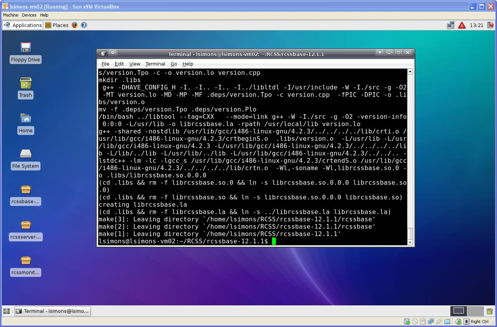

+++
title = "Installing RoboCup Soccer Simulator on Ubuntu"
date = 2011-02-02
[taxonomies]
tags = ["linux", "robocup"]        
+++

> Note: this tutorial is pretty old and should not be trusted.

While it may have been obvious to some, installing the RoboCup Soccer Simulator (RCSS) got caught up on a number of snags. In order to make everyone else’s life easier, this tutorial steps through the installation process for RCSS with some notes and commentary I picked up along the way. While the development server was an Xubuntu virtual machine, this document should be largely applicable to typical Ubuntu installations.

<!-- more -->

# Step 1: Get the Necessary RCSS Packages

You will need the rcssbase, rcssserver, and rcssmonitor packages which are available at http://sourceforge.net/project/showfiles.php?group_id=24184. The versions used for this tutorial are 12.1.1, 12.1.3, and 12.1.0 respectively. Once downloaded, extract all three to a convenient location.


As much as I dislike working from the command prompt, we’re going to be using it pretty heavily during the install since we will be working with superuser priveleges. Open a terminal and navigate to your rcssbase directory. Once there, execute the configure script using sudo.

```sh
cd RCSS/rcssbase-12.1.1/ sudo ./configure [enter sudo password]
```

Whoops, I don’t have a C++ compiler yet. Using the Applications panel, open “System” -> “Synaptic Package Manager”. Use the search tool to find the g++ Ubuntu package, mark it for install, and install it.


So lets try that again

```sh
sudo ./configure [enter sudo password]
```

Well, we made it farther. Turns out we need the Boost C++ libraries to compile RCSS. On top of this, the Ubuntu Boost package you can find in the Synaptic Package Manager doesn’t install all the Boost libraries you need. After banging my head on this for about an hour, I found some advice online and installed the additional Boost libraries at the command prompt. Once they are succesfully installed we can hopefully make it through configure.

```sh
sudo apt-get install libboost-* sudo ./configure [enter sudo password]
```


The next step is to compile the rcssbase package.

```sh
sudo make [enter sudo password]
```



Finally, we install the package

```sh
sudo make install [enter sudo password]
```

I’ve added the screenshots for these steps to illustrate the final output of each of these steps, since it’s not too intuitive if you’ve succeeded or not. As a rule of thumb, compiling tends to fail in a big way. If you make it to gentle “Leaving directory” statements without rows and rows of errors, your likely ok. If you’re unsure, you can always read the output.


There’s one last thing we have to do before moving on. If you read through the output of the “make install” step, you will have noticed it complaining about libraries having been installed. To make these libraries accessible to other programs, we have two options. We can either list them in /etc/ld.so.conf, or we can create a file for listing RoboCup libraries inside the /etc/ld.so.conf.d directory. We’re going to go with that one since it keeps us out of an important system file.

```sh
cd /etc/ld.so.conf.d sudo pico robocup.conf
```

In the file, we add two lines. One is to label the contents for our sake, and the other is to point to the directory make install was whining about.

```
# RoboCup Soccer Simulator Libraries /usr/local/lib
```

After saving our new file in Pico, we sudo run ldconfig to update our dynamic loader cache.

# Step 3 – Installing RCSS Server

Now we walk through the same series of steps inside the rcssserver directory.

```sh
sudo ./configure
sudo make
sudo make install
```

I lucked out and didn’t have to add any more packages to compile and install, but if you hit a snag, just make sure to read the messages. Once you have successfully installed rcssserver, we need to add another line to our robocup.conf file

```
# RoboCup Soccer Simulator Libraries
/usr/local/lib
/usr/local/lib/rcssserver/modules
/
```

Again, `sudo run ldconfig` to update the dynamic loader cache.


Unfortunately, we’re going to need more libraries before we can install the monitor package. We can use the Synaptic Package Manager to install the libxpm development packages.


Now ./configure, make, make install that sucker. During the install, make threw-up many warnings. But so far I have ignored them and have not yet received punishment.

# Step 5 – Run, Hopefully

> Wait.  I wasn't going to say anything when you skipped Step 2, but what happended to 4?

Open up two fresh terminals. In the first, type `rcss` followed by the tab key twice. If everything’s gone well, you should see a list of RCSS related programs we now have. Start the RCSS server running by entering “rcssserver”. There is no need to run the server with superuser privelages.

In your other terminal, start the RCSS monitor by entering `rcssmonitor`. Your first terminal should report a new monitor has connected. You can select “connect” in the rcssmonitor GUI and then “kick off” to see what happens if you had two teams of rocks make it to the World Cup. Connecting clients (soccer players) is for another tutorial.


# References
Help installing robocup server – http://ubuntuforums.org/showthread.php?t=721261
