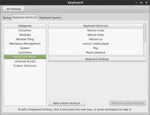

+++
title = "Kodi, Infrared Remote, and Cinnamon Linux 17.1"
date = 2015-01-27
[taxonomies]
tags = ["linux", "kodi", "mint"]
+++

[Back in 2013](/low-cost-universal-remote-for-xbmc-on-ubuntu/), I programmed an [inexpensive media remote](http://www.amazon.com/gp/product/B0028IKXLS/ref=as_li_qf_sp_asin_tl?ie=UTF8&camp=1789&creative=9325&creativeASIN=B0028IKXLS&linkCode=as2&tag=louissimonsco-20) to control XBMC on Ubuntu with the help of a [cheap infrared PC remote control](http://www.amazon.com/gp/product/B001M56DI0/ref=as_li_qf_sp_asin_tl?ie=UTF8&camp=1789&creative=9325&creativeASIN=B001M56DI0&linkCode=as2&tag=louissimonsco-20).  Since then, I’ve messed up that Ubuntu install pretty well, so updating seemed like a good idea.

<!-- more -->

I installed Linux Mint 17.1 and Kodi, the latest incarnation of XBMC.  Unfortunately, some of the media keys on the remote did not work, e.g. play.  Whenever I pressed them, I received a do-not-enter circle-cross symbol whether or not Kodi was running.  Eventually, I found that the media keys worked properly for Banshee, and this lead me down the path the Mint was consuming the commands.  Eventually, I found a [posting that resolved the issue by clearing out Mint’s keyboard shortcuts](http://forum.kodi.tv/showthread.php?tid=215696&highlight=media+key).

# How to Fix It

Screenshot from 2015-01-27 16:29:21In the Linux Mint 17.1 settings, any assigned keyboard shortcuts prevent Kodi from seeing the remote commands.  I cleared out all of the keyboard shortcuts under “Sound and Media” as “Launch email client” from the “Launchers” category.  The shortcuts configuration window is available from System Settings > Keyboard in the Keyboard Shortcuts tab.

After this, all of the shortcuts from my earlier post work.

The shortcut configuration window is actually a screenshot from Mint 17, but it’s nearly identical on 17.1.
