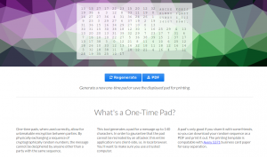

+++
title = "One-Time Pad Generator"
date = 2014-12-14
[taxonomies]
tags = ["cryptography"]
+++

Let's combine elementary school cryptography with popular social messaging services.  I made a simple one-time pad generator available [here](http://tweetpad.louissimons.com).  The source code is [on github](https://github.com/superlou/tweet_pad).

<!-- more -->

