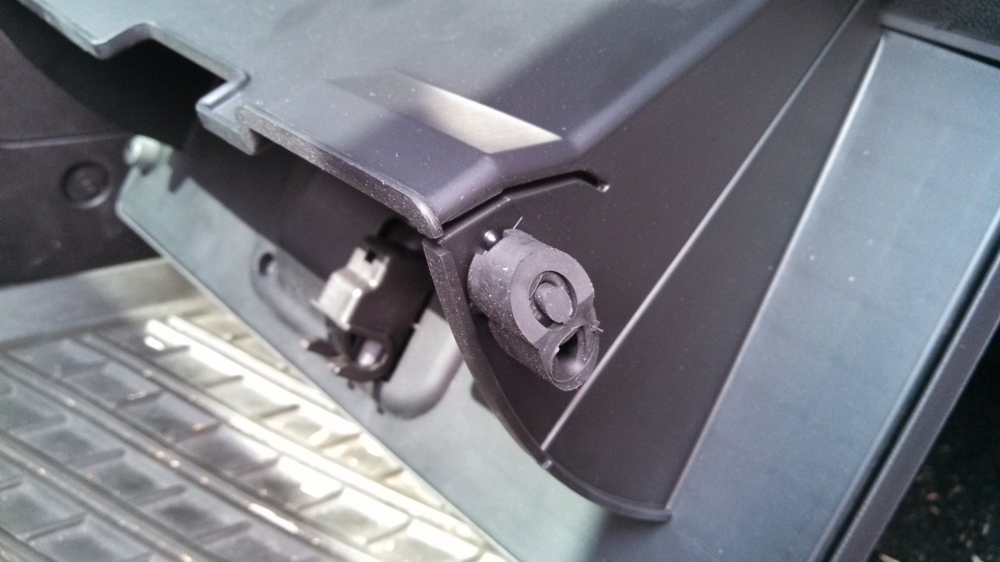
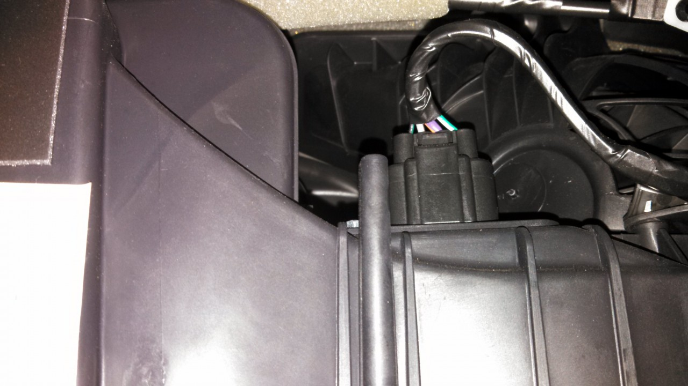
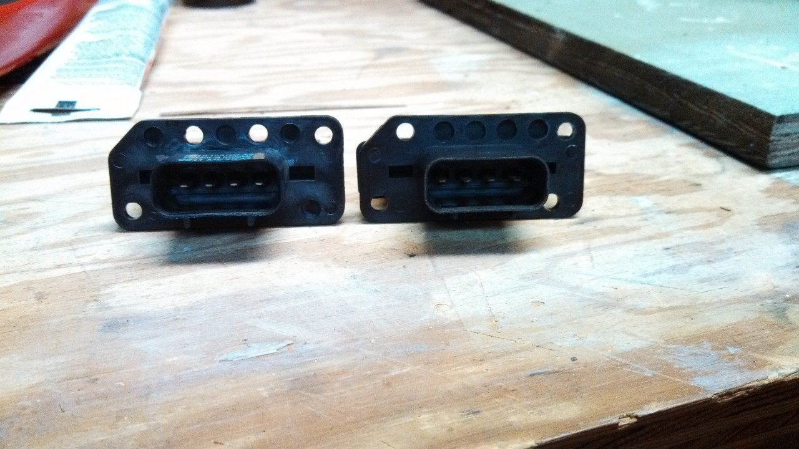
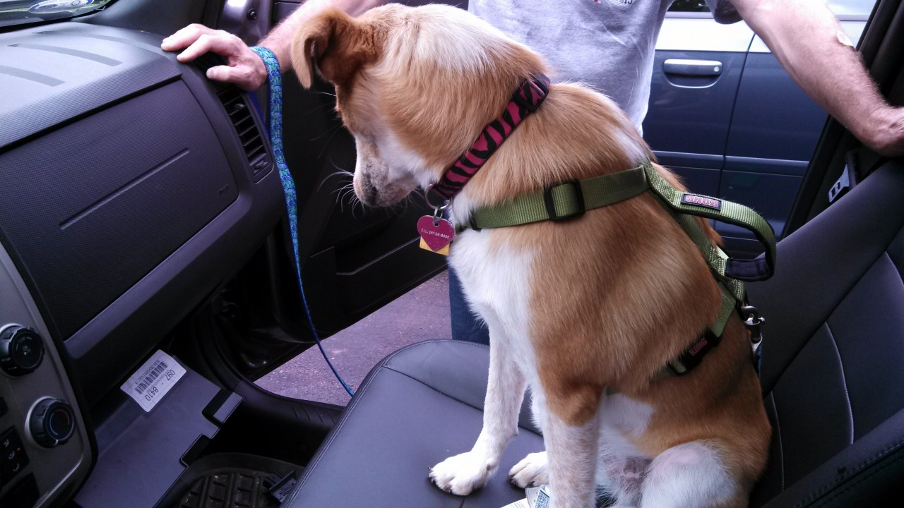

+++
title = "Replacing the A/C Blower Resistor on a 2009 Ford Escape"
date = 2013-07-07
[taxonomies]
tags = ["automotive", "escape", "ford"]
+++

The A/C system of the Ford Escape has a resistive sensing element used regulate the blower motor.  If you find that the A/C blows air on some fan speeds but not others, it is likely that the blower motor resistor has burned out or otherwise failed.  On my 2009 Escape, the blower motor would run in positions 3 and 4, but not 1 or 2.  Based on other reports online, failing for the low speed settings seems to be the most common symptom.

<!-- more -->

Replacing the resistor on the 2009 is cheap and simple, but since I could only find photos for the 2008 Escape, I took some pictures while my dad and I replaced the part.  I replaced the defective resistor with a [CARQUEST RU1133](http://shop.advanceautoparts.com/webapp/wcs/stores/servlet/product_hvac-blower-motor-resistor-bwd_10017329-p) from Advanced Auto Parts though it is available from multiple distributors.  My Escape does not have automatic temperature control, as the temperature is set using a cold/warm knob and not via a digital temperature set in degrees.  You may need a different part if you have automatic temperature control.

# Procedure

Open the glovebox and empty it out.  Near the top of the glovebox left and right sides, squeeze inwards gently to allow the glovebox to fully extend.

The resistor is inserted into a slot towards the right behind the glovebox and fastened with two hex-head screws.

Remove the screws with a 5/8″ socket and detach the harness.  I found it was easier to leave the harness on until after removing the screws since it kept the wires out of the way.

The keying on the original resistor (left) and new resistor (right) did not match, so I had to drill out two holes along the top.  Make sure to completely open the key holes so that it clears the alignment keys during installation.  I’m hoping this is so that the same part can be used on slightly different models, and not that I have the wrong part.

Re-install the resistor into the slot.  When fastening with the screws be careful not to cross-thread the soft plastic or over tighten.  When trying to locate the screws by feel, they will go in the front-left and back-right holes looking from the passenger seat towards the resistor.

Reconnect the harness.

Test the A/C system for each blower position to verify that the replacement is working.

Set the glovebox back behind the stops and remove the dog from the passenger seat.

