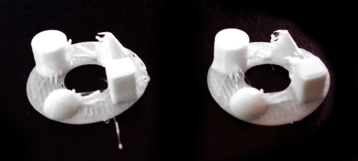
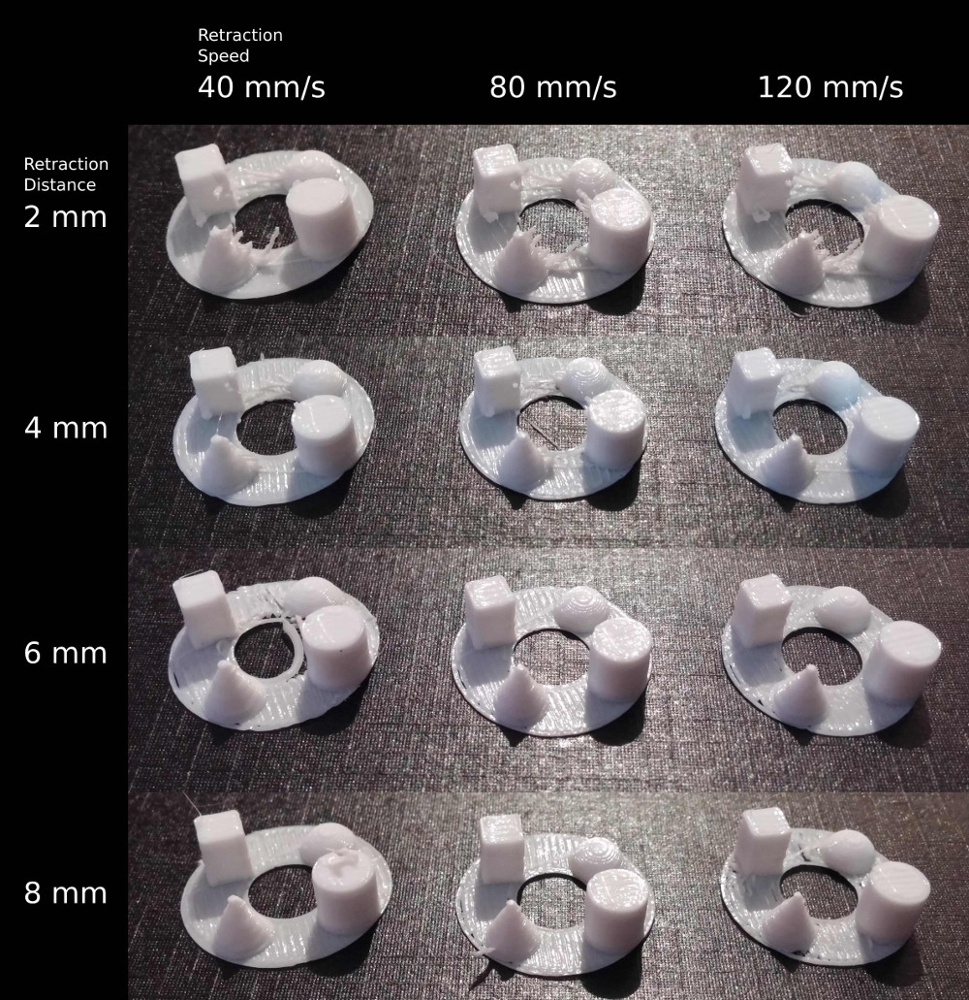
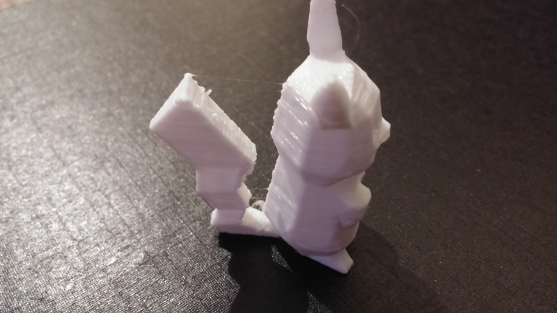
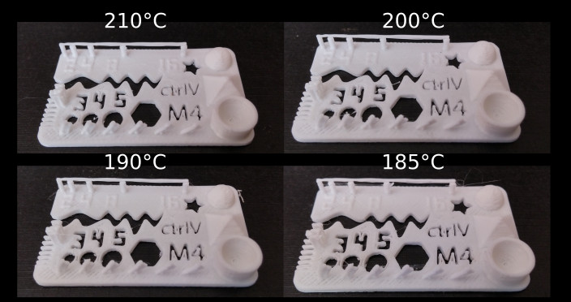

+++
title = "3D Printer Retraction Calibration"
date = 2016-07-24
+++

I bought an AliExpress Kossel Mini kit that is usually listed as an "FLSUN."  It's been a great learning experience.  The latest challenge has been tuning the retraction settings to minimize the amount of stringy material carried by the nozzle as it moves between positions.  Note that this printer uses a Bowden extruder.  **The values that worked for me should not be used for a direct feed extruder.**

<!-- more -->

The printer has the following configuration:

* Firmware - Marlin 1.1.0-RC6
* Host Software - Repetier Host 1.6.2
* Slicer - Curaengine
* Material - Hatchbox 1.75 mm PLA, white
* Temperature - 200°C, this might have been a little hot given the glossiness of the prints

There are primarily two settings that affect retraction:

* Distance - how far the filament is pulled back into the extrusion head
* Speed - how fast the filament is pulled back into the extrusion head

I first disabled all retraction by setting both distance and speed to 0.  Using vector's [retract/ooze test model](http://www.thingiverse.com/thing:22263) from Thingiverse, I printed the base case (twice):

You can see that the stringing is severe between the towers.  I then printed an array of tests, increasing the retraction distance and speed:

From these trials, I've been using 6mm and 80 mm/s, since it seems to be the point where there is minimal further reduction in stringing.  The printer seems to be significantly more sensitive to changes in retraction distance than retraction speed.  These values worked for me using a Bowden extruder, which typically requires a longer retraction distance compared to a direct feed extruder.  When calibrating your own printer, remember to start small and only change one variable at a time, increasing the retraction length by small amounts.  If I did this again, I'd probably increase by 1 mm per step rather than 2 to find the smallest retraction distance that minimizes stringing.

However, I still have some issues with warts as the print head moves, though I don't know if those can be fixed through improved retraction settings.  You can see the warts between the tail and the back of the body.

Based on some feedback online, I ran a series of temperature tests using a [more complicated model](http://www.thingiverse.com/thing:1019228), hoping that the fine features would provide more insight.  Each print was run with 6 mm, 80 mm/s retraction:

The results were less dramatic than I expected, and the small changes are hard to see from the pictures.  There was no sign of delamination or poor adhesion down to 185°C.  There was a small improvement in the "fingers" along the near-left side of the print as the temperature was decreased.  Somewhat counterintuitively, stringing seemed to become worse as the temperature decreased.  At the lowest temperature, there were significantly more surface imperfections compared to 190°C, so that's what I've decided to use for this filament.

Does anyone have any tips on what to try next?
