+++
title = "Setting up libGDX on Ubuntu 13.04"
date = 2013-06-20
[taxonomies]
tags = ["linux", "games"]        
+++

I recently received an Ouya and want to try coding a game for it. While the favorite child for Ouya developments seems to be Unity3D, the Unity IDE cannot be run on Linux.  While there are a huge set of frameworks and game engines for developing on Android, I didn’t want to have to do game testing entirely via an Android Virtual Device or by loading onto a phone.  Fortunately, libGDX provides a cross platform framework that should let me do most of the testing in on my PC.

<!-- more -->

# Setup

Create a libGDX Project in Android Developer Tools.

The libGDX wiki has a list of [prerequisites](http://code.google.com/p/libgdx/wiki/Prerequisits) but instead of using standalone Eclipse and installing the Android SDK, we’re going to use the Android Developer Tools Bundle which contains an IDE (based on Eclipse) with the Android SDK already bundled and configured.  When dealing with many Eclipse plugins and environments targeting very specific tool-chains, I find that the seperate Eclipse instances make configuration easier to debug.  Get the ADT Bundle from [downloads](http://developer.android.com/sdk/installing/bundle.html).  I’m using the 64-bit bundle with the build suffix 20130522.  Unzip it into a folder like `~/ouya`.

Start ADT at `~/ouya/adt-bundle-linux-x86_64-20130522/eclipse/eclipse`, and install the Google Web Toolkit Plugin into ADT.  You will need to follow the instructions from https://developers.google.com/eclipse/docs/install-eclipse-4.2 to get the version compatible with Eclipse 3.8 which is what ADT is currently built on.  If you are using a later version of ADT, you may need to point at a different installation site.

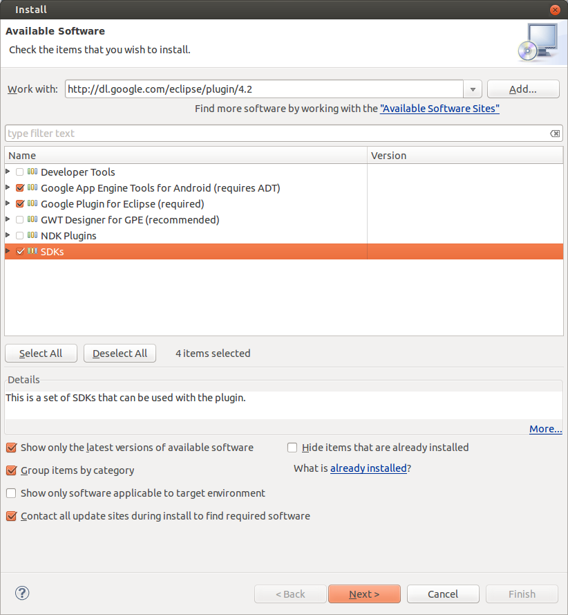

Click next, agree to the licenses, and install.

Download the libGDX SDK from the [stable releases](http://code.google.com/p/libgdx/downloads/list).  I am using version 0.9.8.  I unzipped it into ~/ouya.  Set the executable bit on gdx-setup-ui.jar, and run it using a JDK runtime.  The GUI should start.

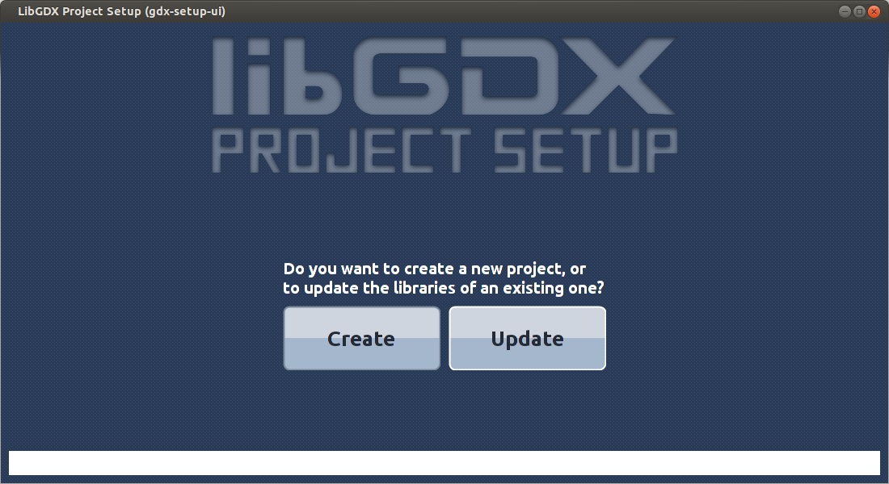

Create a project and configure it as befits your project.  Mine is about boats.

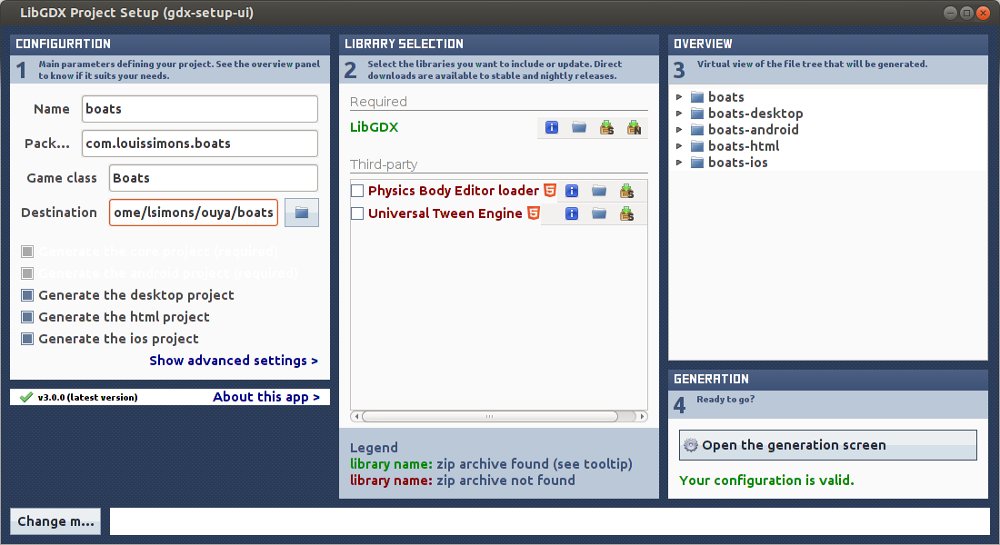

If the LibGDX library listed under required libraries is red, download it by clicking on the “download latest stable version” icon.  Once you get the pleasant “Your Configuration is valid” notification, click on “Open the generation screen.”  Click “Launch!” to generate your projects.

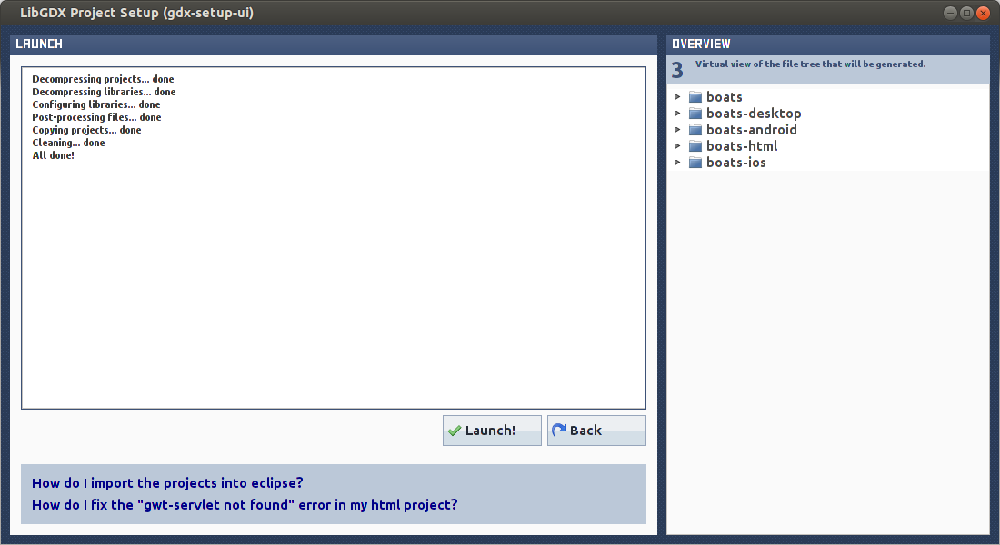

Back in ADT, we can import our new projects.  In the ADT menu bar, choose File > Import… and from the General folder, select “Existing Projects into Workspace.”  Press next, and set the root directory to the location of your libGDX projects.

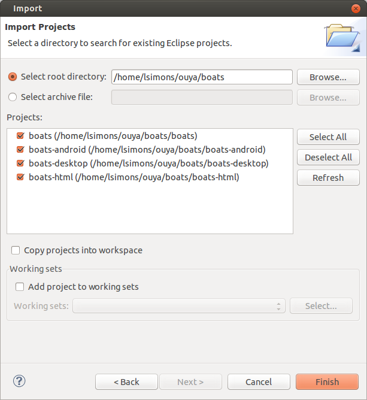

After the import, I had a build error on the boats-android project.  To resolve it, edit the project’s properties and select an Android Build Target.

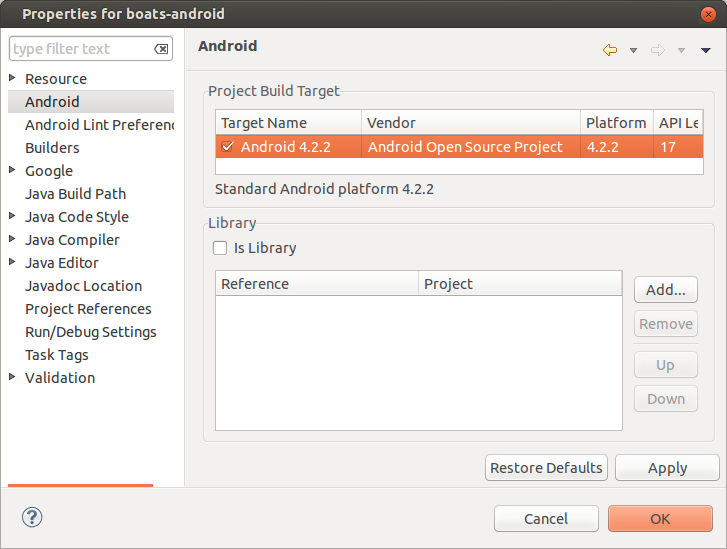

I also had a build error on the boats-html project which was fixed by selecting the GWT SDK to be added to the project’s build path.

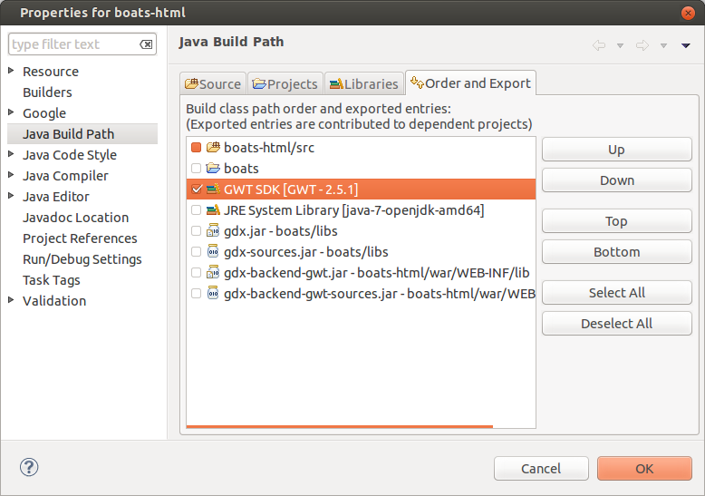

# Run the Project

## Android

Select the android project, and chose run from the menu.  If you receive a “No active compatible AVD’s or devices found…” error, edit the project’s run configurations and select an Android Virtual Device.

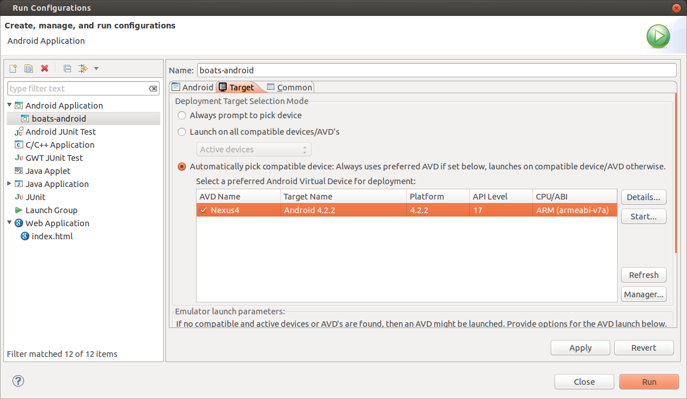

If you don’t  have an AVD, [create one](http://developer.android.com/tools/devices/managing-avds.html).  Click run, and wait (possibly for a few minutes) for the AVD to start.  If successful, you should see the application start up.

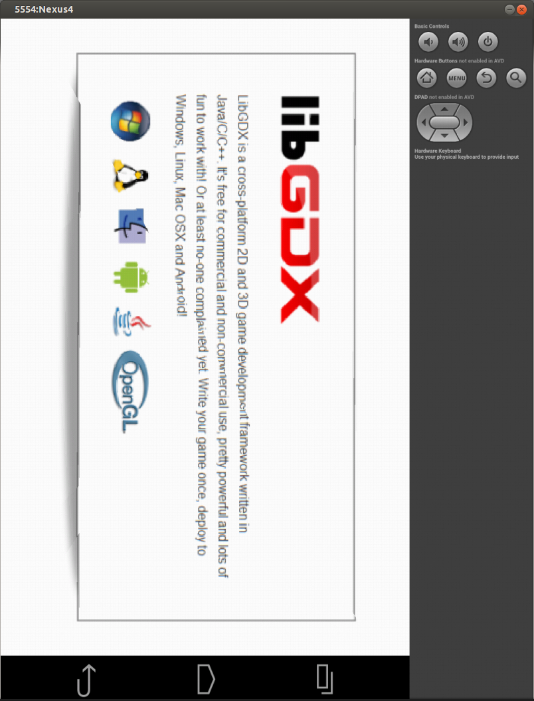

I was also able to run the application on my phone, though I haven’t figured out how to take a picture of my phone with my phone.

## Desktop

Select the desktop project and run as a Java Application.

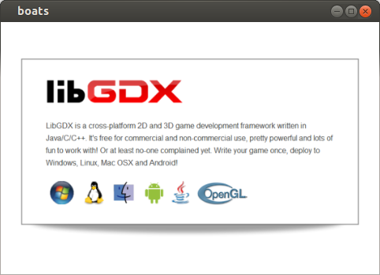

## HTML5

When you run the html project, a development server will start with a link to open the game in the browser.  Firefox will alert that “Development Mode requires the Google Web Toolkit Developer Plugin.”  Install the plugin, and after Firefox restarts, you should see the default game.

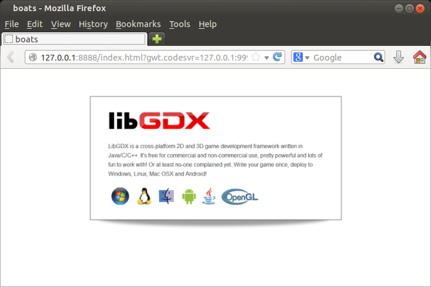

# Conclusion

It sure looks like libGDX is running cross-platform, as promised.  I’m going to have to learn some Android programming to see if I can find any gotchas, but so far it looks good.  The next step is to try loading the game onto my Ouya.  The whole configuration went remarkably smoothly, so let me know if you encounter any obstacles.
