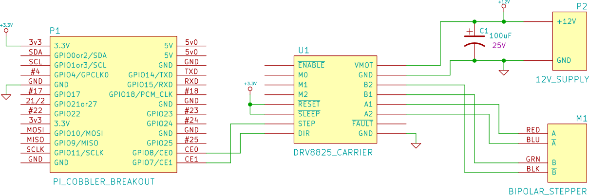

+++
title = "Simple Stepper Motor Control with Raspberry Pi"
date = 2014-09-20

[taxonomies]
tags = ["raspberry pi", "linux", "electronics", "c", "drv8825", "stepper motor"]
+++

Stepper motors are a type of brushless DC motor that can be controlled so that they advance a fixed step size.  Additionally, they provide a strong holding torque.  This can make them useful in applications where you want to rotate the motor precisely without employing encoders.  When prototyping, I like to use development boards that can be transferred to a custom PCB easily.  This gives me a clear path if I want to move the design from the Protoboard to something more polished.

<!-- more -->

Here’s the parts list:

* [Pololu DRV8825 carrier](1)
* [57oz-in 1Nm NEMA 17 Stepper Motor 1.3A 40mm for CNC router or mill](2)
* [100 Pcs 25V 100uF 105C Radial Lead Electrolytic Capacitors](3)
* [Raspberry Pi Model A (256MB)](4) – I had a Model A laying around, but you should be able to use the [Model B](5) with a little modification
* [Adafruit Pi Cobbler Breakout Kit for Raspberry Pi – Assembled!](6) – If you are using the Model B, you may want the [breakout for the full model B GPIO header](7)
* [HiMart New DC 12V 3A Switching Power Supply Adapter For 110V- 240V AC 50/60Hz 2.1mm With HiMart Robbin](8)

[1]: http://www.pololu.com/product/2133
[2]: http://www.amazon.com/gp/product/B00C4P382G/ref=as_li_tl?ie=UTF8&camp=1789&creative=9325&creativeASIN=B00C4P382G&linkCode=as2&tag=louissimonsco-20&linkId=T7LOUQODP7GUFOLJ
[3]: http://www.amazon.com/gp/product/B005XJ7MLS/ref=as_li_tl?ie=UTF8&camp=1789&creative=9325&creativeASIN=B005XJ7MLS&linkCode=as2&tag=louissimonsco-20&linkId=THGIESXP2WJL2NJQ
[4]: http://www.amazon.com/gp/product/B00BC0ZL88/ref=as_li_tl?ie=UTF8&camp=1789&creative=9325&creativeASIN=B00BC0ZL88&linkCode=as2&tag=louissimonsco-20&linkId=42Z4VSP5GWICIHWU
[5]: http://www.amazon.com/gp/product/B00LPESRUK/ref=as_li_qf_sp_asin_il_tl?ie=UTF8&camp=1789&creative=9325&creativeASIN=B00LPESRUK&linkCode=as2&tag=louissimonsco-20&linkId=X6OMZGSJIBUY76BS
[6]: http://www.amazon.com/gp/product/B00EBXP3R2/ref=as_li_tl?ie=UTF8&camp=1789&creative=9325&creativeASIN=B00EBXP3R2&linkCode=as2&tag=louissimonsco-20&linkId=PX5BTVIBNGEI3HGU
[7]: http://www.amazon.com/gp/product/B00M4C6HIQ/ref=as_li_qf_sp_asin_il_tl?ie=UTF8&camp=1789&creative=9325&creativeASIN=B00M4C6HIQ&linkCode=as2&tag=louissimonsco-20&linkId=W3VPG66UJIJG4MVE
[8]: http://www.amazon.com/gp/product/B00JCNJDS6/ref=as_li_tl?ie=UTF8&camp=1789&creative=9325&creativeASIN=B00JCNJDS6&linkCode=as2&tag=louissimonsco-20&linkId=OZRO6EEFA4T64ZTG

Wait.  Didn’t you say that you wanted a clear path to an integrated PCB design?  Why use the Pi then?  You’ll be hard-pressed to design that SoC into your own design, or at the least, make a full Linux compatible single board PC.  Because I’m a hypocrite.  Maybe we’ll connect it to a joystick down the road, and this will make life easier.

# The Circuit

The minimum number of connections are used for this proof-of-concept.  I’m using the pins labeled GPIO 7 and GPIO 8 in the [Raspberry Pi documentation](http://elinux.org/RPi_Low-level_peripherals) to control the DRV8825’s STEP and DIR inputs, respectively.

Make sure to turn the DRV8825 carrier board’s potentiometer fully counter-clockwise.  This will severely limit the coil current, but prevent burn-out before we are ready to set this properly.

# The Software

There are a few options for controlling the Pi’s GPIO pins.  I’m going to avoid the high-level libraries to get high-speed control of the IO pins. Joonas Pihlajamaa provides a [through benchmark of the various options](http://codeandlife.com/2012/07/03/benchmarking-raspberry-pi-gpio-speed/), showing that C is needed to get high-speed control of the GPIO.  We could probably write a Python wrapper around some C code to get achieve high speed control, but for simplicity, lets use the minimum needed to verify that our circuit is working.  The 3 files `main.c`, `gpio.c`, and `gpio.h` are all that is needed to get the motor turning.  It’s nearly identical to the [RPi low-level peripheral example](http://elinux.org/RPi_Low-level_peripherals#GPIO_Code_examples), though I wrapped some of the operations for convenience.

The project’s code is [available on Github](https://github.com/superlou/LittleCrane/tree/e7e8925b49a057510ea73f964184423b85ec17d3).

# The Test

Turn the potentiometer clockwise 20 degrees or so. With the Raspberry Pi header or 12 V supply disconnected, you should be able to rotate the stepper motor shaft by hand. With both connected, the DRV8825 will be enabled and the stepper will hold. The torque required to rotate the motor should feel much higher and you can hear a high pitched whine from motor, though the later varies with hold torque, age, and hearing damage. Follow [Pololu’s procedure](http://www.pololu.com/product/2133) to adjust the power limiting via the potentiometer.

The test program must be executed with “sudo” or as root because it accesses `/dev/mem`. If everything works out, the motor should spin smoothly when you run the program.

<iframe src="https://player.vimeo.com/video/106688542" width="500" height="334" frameborder="0" webkitallowfullscreen mozallowfullscreen allowfullscreen></iframe>

