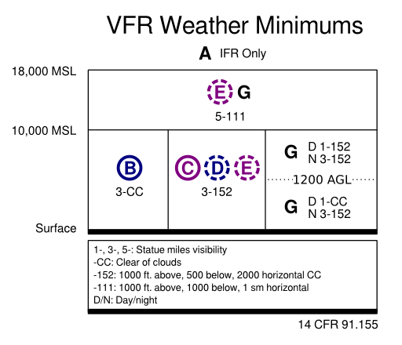

+++
title = "VFR Flight Minimums"
date = 2014-12-14

[taxonomies]
tags = ["flying"]
+++

While studying for the Private Pilot Knowledge (Written) Test, I had a hard time memorizing the rules governing the minimum requirements for VFR in the difference airspaces.  A fellow student pilot found [this sketch](http://www.flickr.com/photos/agentdero/8708028365/in/photostream/) by [R. Tyler Croy](https://www.flickr.com/photos/agentdero/).  I really like how it distilled the rules into something small enough to jot down at the beginning of the exam.  I drew up a very similar chart, correcting for 1200 AGL rather than MSL.

<!-- more -->

