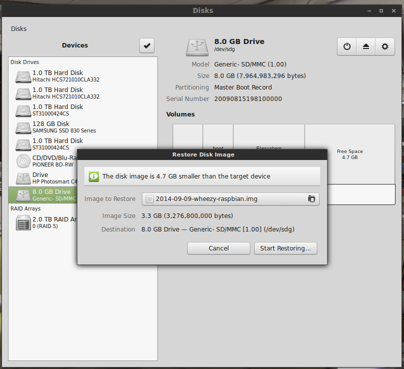

+++
title = "Writing a Raspberry Pi Image Using the Ubuntu DiskUtil"
date = 2013-09-17

[taxonomies]
tags = ["raspberry pi", "linux"]
+++

The basic steps for loading a Raspberry Pi image after downloading and unzipping the image (to `/dev/sdg1` for example) are:

```
sudo umount /dev/sdg1
sudo dd bs=4M if=2013-09-10-wheezy-raspbian.img of=/dev/sdg1
sudo sync
```

This didn’t work for me.  It seemed to write the data but left the card unbootable by the RPi.  In addition, I couldn’t mount and view the contents in Ubuntu either.  Not sure why, though there’s probably something obvious I’m missing.  Instead, I found a lazier solution: using the Ubuntu Disks graphical tool.  Find your drive in the device list, stop it if necessary, and then use the “Restore Disk Image…” option from the actions cog button.


